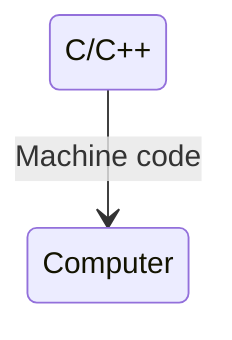
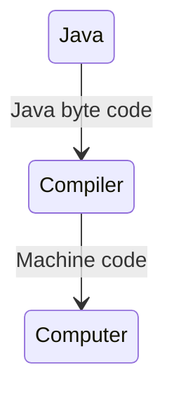
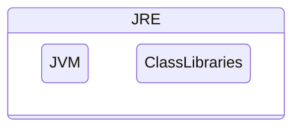
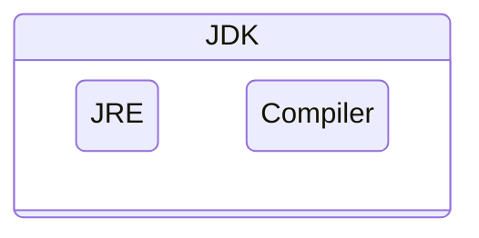

# Java

```mermaid
stateDiagram-v2
    C/C++ --> Computer: Machine code
```

```mermaid
stateDiagram-v2
    Java --> Compiler: Java byte code
    Compiler --> Computer: Machine code
```

## Core

```mermaid
stateDiagram-v2
    JRE
    state JRE { JVM }
    state JRE { ClassLibraries }
```

```mermaid
stateDiagram-v2
    JDK
    state JDK { JRE }
    state JDK { Compiler }
```

- JRE only executes the code, no compilation
- JDK develop, compile and executes the code