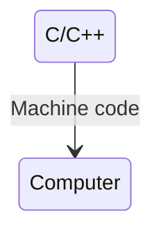
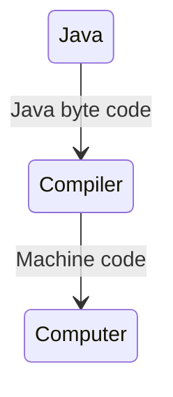
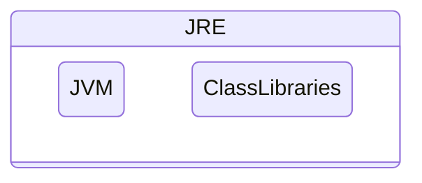
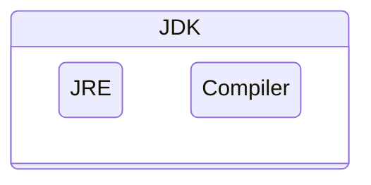

# Java

## Core

### JVM (Java Virtual Machine) 
- A virtual machine that runs Java bytecode.
- Converts the compiled .class files (bytecode) into machine-specific instructions.
- java bytecode is what the JVM executes. Disassemble java source file to byte code `javap -c Hello`
- Key points:
  - Platform dependent (different JVMs for Windows, Linux, macOS), but bytecode is platform independent.
  - Handles memory management, garbage collection, and security.
  - Provides Just-In-Time (JIT) compilation to optimize runtime performance.

### JRE (Java Runtime Environment)

- A runtime environment that provides everything needed to run a Java program.
- JRE Contains JVM , Core libraries (e.g., java.lang, java.util, java.io, etc.) and Supporting files
- Key points:
    - Can run Java applications, but cannot compile them.
    - Ideal for end-users who just need to execute Java programs.
    - JVM + libraries = a complete package to run Java.
### JDK (Java Development Kit)

- A full development kit for building, compiling, and running Java applications.
- JDK Contains JRE (which includes JVM + libraries) and Development tools such as javac (compiler), jdb (debugger), jar (packager), etc.
- Key points:
    - Needed by developers to write and build Java code.
    - Different editions exist: Java SE, Java EE (Jakarta EE), Java ME.
    - JRE + development tools = everything for writing and running Java.