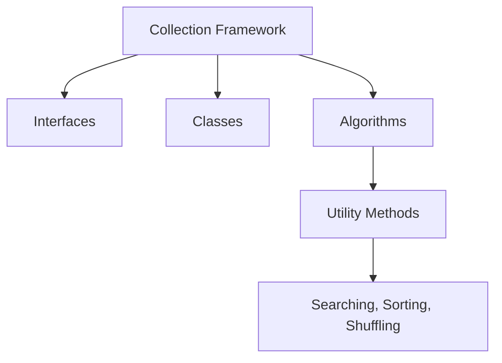
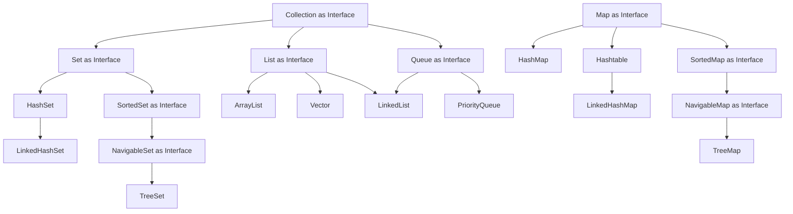
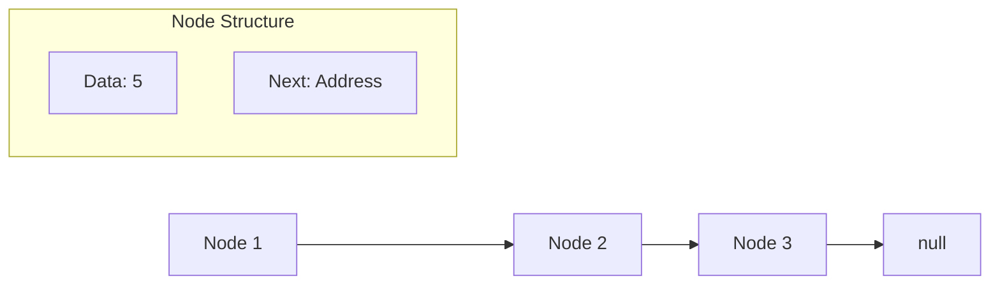
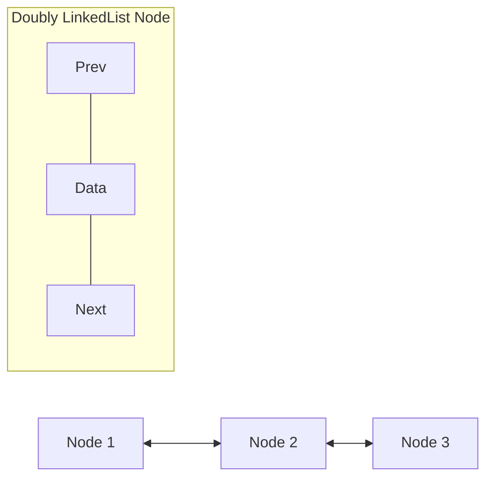

# Java Collections Framework

## Table of Contents

1. [Introduction to Collections](#introduction-to-collections)
2. [Collection Framework Components](#collection-framework-components)
3. [Types of Collections](#types-of-collections)
4. [ArrayList Implementation](#arraylist-implementation)
5. [Sorting Collections](#sorting-collections)

---

## Introduction to Collections

### What is a Collection?

- A **Collection** is a data structure that represents a group of objects or data. It serves as a container for managing multiple objects efficiently.
- Java Collections Framework provides interfaces, classes, and algorithms for efficient data manipulation

### Collection Framework Components

The Java Collections Framework consists of three main components:



### Collection Interfaces

**Purpose:** Provide abstract data types to represent collections

**Key Interface:** `Collection` (from java.util package)

- Root interface of the collection framework hierarchy
- Contains essential method declarations that every collection must implement
- Key methods: `size()`, `add()`, `iterator()`, `remove()`, `clear()`

**Main Interfaces:**

- **Set**: Extends Collection interface
- **List**: Extends Collection interface
- **Queue**: Extends Collection interface
- **Map**: Does NOT inherit from Collection interface but is part of the framework

**Location:** All interfaces are in the `java.util` package

### Algorithms

**Purpose:** Provide common functionalities through utility methods

**Key Operations:**

- Searching
- Sorting
- Shuffling
- Other collection manipulations


###  Collection  Hierarchy

[CollectionInterface](Java/core/Readme/Diagrams/CollectionInterfce.png)



---

## Types of Collections

Based on interfaces and classes, we get **four main flavors** of collections:

###  List

**Use Case:** Store ordered list of things (persons, vehicles, etc.)

- Maintains insertion order
- Allows duplicate elements
- Index-based access
- Implementation Classes: `ArrayList`, `Vector`, `LinkedList`

**When to Use:** When you need to store a list of items and maintain their order

###  Set

**Use Case:** Store unique elements only

- No duplicate elements allowed
- Implementation Classes: `HashSet`, `LinkedHashSet`, `TreeSet`

**When to Use:** When you need to ensure all elements are unique

### Queue

**Use Case:** Process elements in specific order (FIFO - First In, First Out)

- Elements processed in insertion order
- Implementation Classes: `LinkedList`, `PriorityQueue`

**When to Use:** When you need elements in the same order they were inserted

### Map

**Note**: Does NOT inherit from Collection interface but is part of the framework

**Use Case:** Store objects in key-value format

- Each element has a unique key
- Provides instant access using keys
- No iteration needed to access specific elements
- Implementation Classes: `Hashtable`, `HashMap`, `LinkedHashMap`, `TreeMap`

**When to Use:** When you need quick access to elements using a unique identifier

---

## Collection Characteristics

When choosing a collection, consider these characteristics:

### Ordered vs Unordered

- **Ordered Collection**: Maintains element order when added
- **Unordered Collection**: Does not maintain insertion order

### Sorted vs Unsorted

- **Sorted Collection**: Automatically sorts elements based on specific criteria
- **Unsorted Collection**: No automatic sorting

**Important Rule:** Implementation can never be sorted but unordered because sorting is a specific type of ordering.

### Examples:

- **HashSet**: Unordered and unsorted
- **LinkedHashSet**: Ordered but not sorted (maintains insertion order)
- **TreeSet**: Both ordered and sorted

### Natural Ordering

For automatic sorting, collections use **natural order**:

- **Strings**: Alphabetical order (A before B, Z after Y)
- **Integers**: Numeric order (1 before 2, etc.)
- **Custom Objects**: Must implement `Comparable` interface

---

## Real-World Scenario Analysis

**Scenario:** Store 1000 employee objects, each with ID, name, and designation. Later, fetch employee with ID 538.

### Solution Analysis:

**❌ List Approach:**

```java
// Problem: Need to iterate through entire list
for (Employee emp : employeeList) {
    if (emp.getId() == 538) {
        return emp; // Could require 1000 iterations in worst case
    }
}
```

**❌ Set Approach:**

- Same iteration problem as List
- Only benefit is uniqueness, but doesn't solve access efficiency

**✅ Map Approach (Recommended):**

```java
// Solution: Direct access using key
Map<Integer, Employee> employeeMap = new HashMap<>();
employeeMap.put(emp.getId(), emp); // Store with ID as key

Employee emp = employeeMap.get(538); // Direct access, no iteration!
```

**Performance Comparison:**

- List/Set: O(n) - Linear time complexity
- Map: O(1) - Constant time complexity for access

---

## ArrayList Implementation

**ArrayList** is similar to arrays but with dynamic sizing capabilities:

**Differences from Arrays:**

- **Arrays**: Fixed length after declaration
- **ArrayList**: 
  - Dynamic growth and shrinkage
  - Provides predefined utility methods
  - Fast iteration and random access

**Properties:**

- Ordered collection (by index)
- Not sorted by default
- Allows duplicate elements
- Constructs an empty list with an initial capacity of ten.

### L1:  Basic ArrayList Operations

### Generic Type Safety

```java
// Without generics - allows any type (not recommended)
ArrayList mixedList = new ArrayList();
mixedList.add("String");
mixedList.add(123);
mixedList.add(new Person("Alex", 25, "Male"));

// With generics - type safe (recommended)
ArrayList<String> stringList = new ArrayList<>();
stringList.add("Apple");
stringList.add("Orange");
// stringList.add(123); // Compilation error - type safety


// Good practice - programming to interface
List<String> list = new ArrayList<>();  // Easy to change implementation later

// Avoid - tied to specific implementation
ArrayList<String> list = new ArrayList<>();
```

### ArrayList Constructors

```java
// 1. Default constructor (initial capacity 10)
ArrayList<String> list1 = new ArrayList<>();

// 2. Constructor with initial capacity
ArrayList<String> list2 = new ArrayList<>(5);

// 3. Constructor with existing collection
ArrayList<String> existingList = Arrays.asList("A", "B", "C");
ArrayList<String> list3 = new ArrayList<>(existingList);
```

### Sorting Collections

#### L2: Sorting Primitive Types

The `Collections.sort()` method can sort collections of objects such as String, Numbers that have natural ordering

#### L3: Sorting Custom Objects

For custom objects, you must implement the `Comparable` interface:


#### L4: Advanced Sorting with Comparator

For more complex sorting scenarios, you can use `Comparator`:

### Collection vs Collections vs Collection

**Be careful not to confuse:**

1. **collection** (lowercase): General term for data structure
2. **Collection** (uppercase, singular): Root interface from java.util package
    ```java
    // Collection interface
    Collection<String> myCollection = new ArrayList<>();
    ```
3. **Collections** (uppercase, plural): Utility class from java.util package containing static methods
    ```java
    // Collections utility class
    Collections.sort(myList);          // Static method
    Collections.reverse(myList);       // Static method
    ```

### Performance Considerations

| Collection Type | Access Time | Search Time | Insertion Time | Deletion Time |
|-----------------|-------------|-------------|----------------|---------------|
| ArrayList       | O(1)        | O(n)        | O(n)           | O(n)          |
| LinkedList      | O(n)        | O(n)        | O(1)           | O(1)          |
| HashMap         | O(1)        | O(1)        | O(1)           | O(1)          |
| TreeMap         | O(log n)    | O(log n)    | O(log n)       | O(log n)      |

### Key Takeaways

1. **Choose the right collection type** based on your use case:
    - List: For ordered, indexed access
    - Set: For unique elements
    - Map: For key-value pairs with fast access
    - Queue: For FIFO processing
2. **Consider performance implications** of different implementations
3. **Use generics** for type safety and avoiding ClassCastException
4. **Implement Comparable** for custom objects that need natural ordering
5. **Use Collections utility methods** for common operations like sorting

---

## LinkedList Implementation

### Internal Structure and Design

**LinkedList** uses a different internal structure compared to ArrayList. Data is stored in a structure called **Node**.

### Node Structure

Each Node contains two parts:

1. **Data Part**: Stores the actual data/value
2. **Address Part**: Contains reference to the next node



### LinkedList Methods

```java
LinkedList<String> list = new LinkedList<>();

// Head and Tail operations
list.addFirst("First");        // Add at beginning
list.addLast("Last");          // Add at end (same as add())
list.getFirst();               // Get first element
list.getLast();                // Get last element
list.removeFirst();            // Remove first element
list.removeLast();             // Remove last element

// Peek operations (don't remove elements)
list.peekFirst();              // Get first without removing
list.peekLast();               // Get last without removing

// Poll operations (remove and return)
list.pollFirst();              // Remove and return first
list.pollLast();               // Remove and return last

list.remove();                 // Removes first element
list.remove("A");              // Removes specified element
```

### Singly vs Doubly LinkedList

#### Singly LinkedList

- **Two parts per node**: Data + Next node reference
- **Direction**: Can only traverse forward
- **Structure**: Data -> Next

#### Doubly LinkedList

- **Three parts per node**: Previous reference + Data + Next reference
- **Direction**: Can traverse both forward and backward
- **Structure**: Previous <- Data -> Next



### Performance Comparison: ArrayList vs LinkedList

| Operation                                 | ArrayList                        | LinkedList                     |
|-------------------------------------------|----------------------------------|--------------------------------|
| **Addition/Deletion at beginning/middle** | Slow O(n)                        | Fast O(1)                      |
| **Search Operations**                     | Fast O(1) random access          | Slow O(n) sequential access    |
| **Memory Usage**                          | Less overhead                    | More overhead (extra pointers) |
| **Best Use Case**                         | Frequent searching/random access | Frequent insertion/deletion    |

---

## Vector Implementation

### Historical Context and Characteristics

**Vector** is one of the original collection classes in Java, along with Hashtable. Most other collections were added in Java 1.2 and 1.4.

### Key Differences from ArrayList

| Feature             | ArrayList          | Vector                          |
| ------------------- | ------------------ | ------------------------------- |
| **Thread Safety**   | Not synchronized   | Synchronized (thread-safe)      |
| **Performance**     | Faster             | Slower (due to synchronization) |
| **Capacity Growth** | Increases by 50%   | Increases by 100% (doubles)     |
| **Legacy**          | Modern (Java 1.2+) | Legacy (Java 1.0)               |

### Capacity Growth Comparison

```java
// ArrayList capacity growth
// Initial: 10 -> When full -> 15 (50% increase)

// Vector capacity growth
// Initial: 10 -> When full -> 20 (100% increase)
```

### Vector Code Examples

```java
import java.util.Vector;

public class VectorExample {
    public static void main(String[] args) {
        // 1. Creating Vector
        Vector<String> myList = new Vector<>();

        // 2. Adding elements (same as ArrayList)
        myList.add("A");
        myList.add("B");
        myList.add("C");

        // 3. Vector-specific method
        myList.addElement("D");    // Legacy method, same as add()

        System.out.println("Vector elements:");
        for (String element : myList) {
            System.out.print(element + " ");
        }
        System.out.println();
        // Output: A B C D

        // 4. Accessing elements (same as ArrayList)
        System.out.println("Element at index 1: " + myList.get(1));
        // Output: Element at index 1: B

        // 5. Vector size and capacity
        System.out.println("Size: " + myList.size());
        System.out.println("Capacity: " + myList.capacity());
        // Output: Size: 4, Capacity: 10

        // 6. Removing elements
        myList.remove("B");
        System.out.println("After removing B: " + myList);
        // Output: After removing B: [A, C, D]
    }
}
```

### Thread Safety Example

```java
// Vector methods are synchronized
Vector<String> vector = new Vector<>();

// This is thread-safe but slower
vector.add("Thread Safe");

// ArrayList equivalent (not thread-safe but faster)
ArrayList<String> arrayList = new ArrayList<>();
arrayList.add("Not Thread Safe");

// For thread-safety with ArrayList, use:
List<String> synchronizedList = Collections.synchronizedList(new ArrayList<>());
```

### When to Use Vector

**Use Vector when:**

- Working with legacy code that requires Vector
- Need built-in thread safety
- Working in multi-threaded environment with simple synchronization needs

**Prefer ArrayList when:**

- Single-threaded applications
- Performance is critical
- Modern Java development practices

**Alternative for thread safety:**

```java
// Better approach for thread safety
List<String> threadSafeList = Collections.synchronizedList(new ArrayList<>());

// Or use concurrent collections
List<String> concurrentList = new CopyOnWriteArrayList<>();
```

---

## Summary of List Implementations

### Comparison Table

| Feature                          | ArrayList                | LinkedList                  | Vector                     |
| -------------------------------- | ------------------------ | --------------------------- | -------------------------- |
| **Internal Structure**           | Dynamic Array            | Doubly Linked Nodes         | Dynamic Array              |
| **Random Access**                | O(1)                     | O(n)                        | O(1)                       |
| **Insertion/Deletion at middle** | O(n)                     | O(1)                        | O(n)                       |
| **Memory Overhead**              | Low                      | High                        | Low                        |
| **Thread Safety**                | No                       | No                          | Yes                        |
| **Performance**                  | High                     | Medium                      | Low                        |
| **Best Use Case**                | Random access, searching | Frequent insertion/deletion | Legacy code, thread safety |

### Choosing the Right List Implementation

**Use ArrayList when:**

- Need fast random access to elements
- Perform more read operations than write operations
- Memory efficiency is important
- Single-threaded environment

**Use LinkedList when:**

- Frequent insertion/deletion operations, especially at beginning/middle
- Don't need random access to elements
- Implementing queue or deque operations

**Use Vector when:**

- Working with legacy code
- Need simple thread safety
- Compatibility with old Java versions required

### Best Practices

1. **Default Choice**: Use ArrayList for most use cases
2. **Performance Critical**: Profile your application to choose the best implementation
3. **Thread Safety**: Use `Collections.synchronizedList()` or concurrent collections instead of Vector
4. **Memory Sensitive**: Consider the memory overhead of LinkedList's node structure
5. **Interface Programming**: Declare variables as `List<T>` instead of specific implementation types

