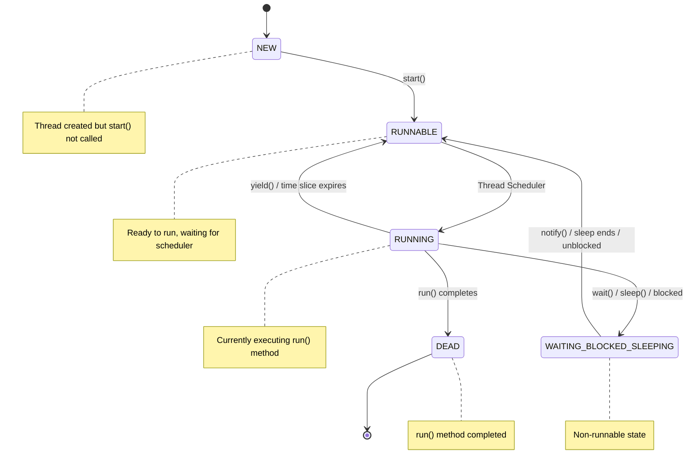

# Java Threading - Comprehensive Study Notes

## Table of Contents
1. [Introduction to Threads](#introduction-to-threads)
2. [Creating Threads](#creating-threads)
3. [Thread Synchronization](#thread-synchronization)
4. [Thread Methods](#thread-methods)
5. [Thread States and Lifecycle](#thread-states-and-lifecycle)
6. [Practical Examples](#practical-examples)

---

## Introduction to Threads

### What is a Thread?
A **thread** allows a program to operate more efficiently by performing multiple tasks simultaneously. It enables executing complicated tasks in the background without interrupting the main program.

### Key Concepts:
- **Multithreading**: The process of executing multiple threads simultaneously
- **Multitasking**: Handling more than one task at the same time (like cooking while singing and dancing)
- **Multiprocessing**: A programmable approach to achieve multitasking

### Benefits of Multithreading:
1. **Memory Efficiency**: All threads share common memory, no separate memory allocation
2. **Performance**: Context switching between threads takes less time than processes
3. **Concurrent Execution**: Multiple users can use the same application simultaneously

### Real-world Examples:
- **Operating System**: Controls multiple processes simultaneously
- **Music Player**: Play music while using word processor and copying files
- **Web Applications**: Handle millions of users concurrently (each user gets a separate thread)

---

## Creating Threads

There are **two ways** to create threads in Java:

### Method 1: Extending Thread Class
```java
class MyThread extends Thread {
    @Override
    public void run() {
        // Code to be executed by thread
    }
}
```

**Advantages:**
- Easier implementation
- Direct thread object creation

**Disadvantages:**
- Cannot extend other classes (single inheritance limitation)
- Not good OOP practice (subclassing should be for specialized versions)

### Method 2: Implementing Runnable Interface (Recommended)
```java
class MyThread implements Runnable {
    @Override
    public void run() {
        // Code to be executed by thread
    }
}
```

**Advantages:**
- Can extend other classes
- Better OOP design
- More flexible

**Thread Instantiation:**
```java
// Method 1: Extending Thread
MyThread t1 = new MyThread();
t1.start();

// Method 2: Implementing Runnable
MyThread obj = new MyThread();
Thread t2 = new Thread(obj);
t2.start();
```

### Important Notes:
- Always override the `run()` method
- Use `start()` method to begin thread execution (not `run()` directly)
- `start()` method calls `run()` method internally

---

## Thread Synchronization

### The Problem
When multiple threads access shared resources simultaneously, it can lead to **data inconsistency**.

**Example Scenario:**
- Flight booking system with 1 available ticket
- Two threads check availability simultaneously
- Both see 1 ticket available
- Both book the ticket
- Result: 2 tickets booked but only 1 was available

### Solution: Synchronization
Synchronization controls access to shared resources, allowing only one thread at a time.

### Synchronized Methods
```java
public synchronized void run() {
    // Only one thread can execute this method at a time
}
```

### Synchronized Blocks
```java
public void run() {
    synchronized(this) {
        // Only one thread can execute this block at a time
    }
}
```

### How Synchronization Works:
1. **Lock Mechanism**: Creates a lock on method/block
2. **Single Access**: Only one thread can enter at a time
3. **Queue System**: Other threads wait until lock is released
4. **Lock Release**: When current thread exits, lock is released

---

## Thread Methods

### 1. sleep(milliseconds)
**Purpose**: Makes thread sleep for specified time
```java
Thread.sleep(1000); // Sleep for 1 second
```
- Throws `InterruptedException`
- Must be handled with try-catch
- Thread goes to non-runnable state

### 2. currentThread()
**Purpose**: Returns reference to currently executing thread
```java
Thread.currentThread().getName(); // Get current thread name
```

### 3. setPriority(int priority)
**Purpose**: Sets thread execution priority (1-10)

**Priority Constants:**
- `Thread.MIN_PRIORITY` = 1
- `Thread.NORM_PRIORITY` = 5 (default)
- `Thread.MAX_PRIORITY` = 10

**Usage:**
```java
thread.setPriority(Thread.MAX_PRIORITY);
int priority = thread.getPriority();
```

### 4. isAlive()
**Purpose**: Checks if thread is still running
```java
boolean status = thread.isAlive();
```

### 5. wait() and notify()
**Purpose**: Inter-thread communication

**wait():**
- Thread goes to wait state
- Must be called within synchronized block
- Doesn't return automatically

**notify()/notifyAll():**
- Wakes up waiting threads
- `notify()`: wakes single thread
- `notifyAll()`: wakes all waiting threads

### 6. yield()
**Purpose**: Pauses current thread to give chance to other threads of same priority
```java
Thread.yield();
```

---

## Thread States and Lifecycle

### Thread State Diagram



### Detailed State Descriptions:

#### 1. NEW State
- **Description**: Initial state when thread object is created
- **Condition**: `start()` method not yet invoked
- **Status**: Not alive
- **Transition**: Moves to RUNNABLE when `start()` is called

#### 2. RUNNABLE State
- **Description**: Thread is ready to run but waiting for CPU time
- **Condition**: `start()` method called, scheduler hasn't selected it yet
- **Status**: Alive
- **Transition**: Can move to RUNNING when scheduler selects it

#### 3. RUNNING State
- **Description**: Thread is currently executing the `run()` method
- **Condition**: Thread scheduler selected the thread from runnable pool
- **Status**: Alive and active
- **Transitions**: 
  - To RUNNABLE (yield, time slice expires)
  - To WAITING/BLOCKED/SLEEPING (wait, sleep, blocked)
  - To DEAD (run method completes)

#### 4. WAITING/BLOCKED/SLEEPING State
- **Description**: Non-runnable state where thread is temporarily inactive
- **Conditions**:
  - **WAITING**: `wait()` method called
  - **BLOCKED**: Waiting for synchronized lock
  - **SLEEPING**: `sleep()` method called
- **Status**: Alive but not executable
- **Transition**: Returns to RUNNABLE when condition is met

#### 5. DEAD State
- **Description**: Thread has completed execution
- **Condition**: `run()` method has finished
- **Status**: Not alive
- **Important**: Cannot be restarted (throws RuntimeException)

---

## Practical Examples

### Example 1: Basic Thread Creation and Execution

```java
// MyThread.java
public class MyThread extends Thread {
    @Override
    public void run() {
        for (int i = 0; i < 3; i++) {
            System.out.println("Thread is: " + Thread.currentThread().getName() + 
                             " I value is: " + i);
            try {
                Thread.sleep(1000); // Sleep for 1 second
            } catch (InterruptedException e) {
                e.printStackTrace();
            }
        }
    }
    
    public static void main(String[] args) {
        System.out.println("Main thread: " + Thread.currentThread().getName());
        
        // Create three threads
        MyThread t1 = new MyThread();
        MyThread t2 = new MyThread();
        MyThread t3 = new MyThread();
        
        // Set thread names
        t1.setName("A");
        t2.setName("B");
        t3.setName("C");
        
        // Start all threads
        t1.start();
        t2.start();
        t3.start();
    }
}
```

**Expected Output (may vary due to thread scheduling):**
```
Main thread: main
Thread is: A I value is: 0
Thread is: B I value is: 0
Thread is: C I value is: 0
Thread is: A I value is: 1
Thread is: B I value is: 1
Thread is: C I value is: 1
Thread is: A I value is: 2
Thread is: B I value is: 2
Thread is: C I value is: 2
```

### Example 2: Thread Synchronization

```java
// SynchronizedThread.java
public class SynchronizedThread extends Thread {
    
    @Override
    public synchronized void run() {
        for (int i = 0; i < 3; i++) {
            System.out.println("Thread is: " + Thread.currentThread().getName() + 
                             " I value is: " + i);
            try {
                Thread.sleep(1000);
            } catch (InterruptedException e) {
                e.printStackTrace();
            }
        }
    }
    
    public static void main(String[] args) {
        SynchronizedThread t1 = new SynchronizedThread();
        SynchronizedThread t2 = new SynchronizedThread();
        SynchronizedThread t3 = new SynchronizedThread();
        
        t1.setName("A");
        t2.setName("B");
        t3.setName("C");
        
        t1.start();
        t2.start();
        t3.start();
    }
}
```

**Expected Output (synchronized execution):**
```
Thread is: A I value is: 0
Thread is: A I value is: 1
Thread is: A I value is: 2
Thread is: B I value is: 0
Thread is: B I value is: 1
Thread is: B I value is: 2
Thread is: C I value is: 0
Thread is: C I value is: 1
Thread is: C I value is: 2
```

### Example 3: Wait and Notify Mechanism

```java
// WaitNotifyExample.java
public class WaitNotifyExample {
    
    public static void main(String[] args) {
        WaitNotifyExample example = new WaitNotifyExample();
        
        System.out.println("Main thread: " + Thread.currentThread().getName());
        
        // Create and start worker thread
        Thread workerThread = new Thread(() -> {
            System.out.println("Thread going to sleep: " + Thread.currentThread().getName());
            try {
                Thread.sleep(10000); // Sleep for 10 seconds
            } catch (InterruptedException e) {
                e.printStackTrace();
            }
            
            // Notify waiting threads
            synchronized (example) {
                example.notifyAll();
            }
        }, "WorkerThread");
        
        workerThread.start();
        
        // Main thread waits
        example.letsWait();
    }
    
    public void letsWait() {
        System.out.println(Thread.currentThread().getName() + " entered");
        
        synchronized (this) {
            try {
                this.wait(); // Wait until notified
            } catch (InterruptedException e) {
                e.printStackTrace();
            }
        }
        
        System.out.println(Thread.currentThread().getName() + " thread waked up");
    }
}
```

**Expected Output:**
```
Main thread: main
main entered
Thread going to sleep: WorkerThread
(10 second delay)
main thread waked up
```

### Example 4: Thread Priority Demonstration

```java
// ThreadPriorityExample.java
public class ThreadPriorityExample extends Thread {
    
    @Override
    public void run() {
        for (int i = 0; i < 5; i++) {
            System.out.println(Thread.currentThread().getName() + 
                             " (Priority: " + Thread.currentThread().getPriority() + 
                             ") - Count: " + i);
            
            try {
                Thread.sleep(100);
            } catch (InterruptedException e) {
                e.printStackTrace();
            }
        }
    }
    
    public static void main(String[] args) {
        ThreadPriorityExample t1 = new ThreadPriorityExample();
        ThreadPriorityExample t2 = new ThreadPriorityExample();
        ThreadPriorityExample t3 = new ThreadPriorityExample();
        
        // Set names and priorities
        t1.setName("Low Priority");
        t1.setPriority(Thread.MIN_PRIORITY); // Priority 1
        
        t2.setName("Normal Priority");
        t2.setPriority(Thread.NORM_PRIORITY); // Priority 5
        
        t3.setName("High Priority");
        t3.setPriority(Thread.MAX_PRIORITY); // Priority 10
        
        // Start threads
        t1.start();
        t2.start();
        t3.start();
    }
}
```

### Key Takeaways:

1. **Thread Creation**: Use Runnable interface for better design flexibility
2. **Synchronization**: Essential for shared resource access
3. **Thread States**: Understanding lifecycle helps in debugging and optimization
4. **Thread Methods**: Each method serves specific inter-thread communication purposes
5. **Priority**: Higher priority threads get preference but not guaranteed immediate execution
6. **Best Practices**: Always handle InterruptedException and avoid deprecated methods

### Common Pitfalls:
- Calling `run()` directly instead of `start()`
- Not synchronizing shared resource access
- Forgetting to handle InterruptedException
- Attempting to restart dead threads
- Over-synchronization leading to deadlocks

This comprehensive guide covers all essential aspects of Java threading as discussed in the transcripts, with practical examples and best practices for effective multithreaded programming.