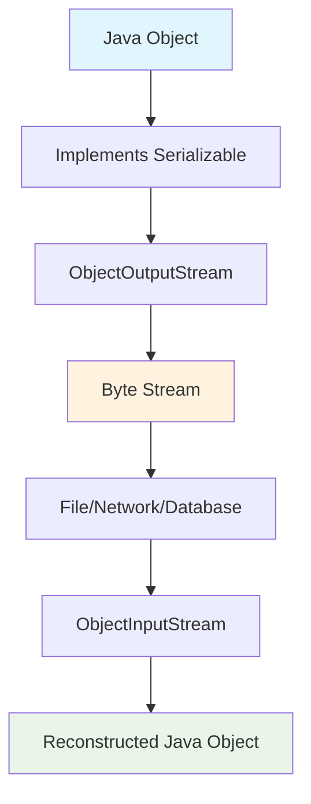

# Java Serialization - Complete Study Notes

## Table of Contents
1. [What is Serialization?](#what-is-serialization)
2. [Why Do We Need Serialization?](#why-do-we-need-serialization)
3. [Serialization Process Flow](#serialization-process-flow)
4. [Implementation Example](#implementation-example)
5. [Key Rules and Best Practices](#key-rules-and-best-practices)
6. [Advanced Concepts](#advanced-concepts)

## What is Serialization?

**Serialization** is a mechanism of writing an object's state into a byte stream. It converts a Java object into a sequence of bytes that includes:
- The object's data
- Information about the object's type
- The types of data stored in the object

**Deserialization** is the reverse process of converting the byte stream back into Java objects.

### Key Characteristics:
- **Platform Independent**: Objects serialized on one platform can be deserialized on different platforms
- **Persistent Storage**: Serialized objects can be saved to files, databases, or memory
- **Network Transfer**: Enables object transmission over network connections

## Why Do We Need Serialization?

### Primary Use Cases:

1. **Network Communication**
   - Java objects cannot be directly transferred over networks
   - Objects must be converted to byte streams for transmission
   - Receiving end can reconstruct the original object

2. **Persistent Storage**
   - Store object state in files
   - Save objects to databases
   - Cache objects in memory systems

3. **Inter-Process Communication**
   - Share objects between different JVM processes
   - Enable distributed computing scenarios

## Serialization Process Flow



## Implementation Example

### Complete Working Example

Below is a comprehensive example demonstrating both serialization and deserialization:

```java
// File: Vehicle.java
package serialization;
import java.io.Serializable;

/**
 * Vehicle class that implements Serializable interface
 * This makes objects of this class eligible for serialization
 */
public class Vehicle implements Serializable {
    // Serial version UID for version control
    private static final long serialVersionUID = 1L;
    
    // Instance variables that will be serialized
    private String brand;
    private String model;
    private int year;
    
    // Static variable - will NOT be serialized
    public static String company = "Global Motors";
    
    // Transient variable - will NOT be serialized
    private transient String password = "secret123";
    
    // Constructor
    public Vehicle(String brand, String model, int year) {
        this.brand = brand;
        this.model = model;
        this.year = year;
    }
    
    // Getters for accessing private fields
    public String getBrand() { return brand; }
    public String getModel() { return model; }
    public int getYear() { return year; }
    public String getPassword() { return password; }
    
    @Override
    public String toString() {
        return "Vehicle{brand='" + brand + "', model='" + model + 
               "', year=" + year + ", password='" + password + "'}";
    }
}
```

```java
// File: SerializationExample.java
package serialization;
import java.io.*;

/**
 * Demonstration of Java Object Serialization
 */
public class SerializationExample {
    
    public static void main(String[] args) {
        // Create a Vehicle object to serialize
        Vehicle polo = new Vehicle("Volkswagen", "Polo GTI", 2021);
        
        System.out.println("=== SERIALIZATION PROCESS ===");
        System.out.println("Original Object: " + polo);
        System.out.println("Static company value: " + Vehicle.company);
        
        // Serialize the object
        serializeObject(polo);
        
        // Modify static variable to demonstrate it's not serialized
        Vehicle.company = "Modified Motors";
        System.out.println("Modified static company value: " + Vehicle.company);
        
        System.out.println("\n=== DESERIALIZATION PROCESS ===");
        
        // Deserialize the object
        Vehicle deserializedPolo = deserializeObject();
        
        if (deserializedPolo != null) {
            System.out.println("Deserialized Object: " + deserializedPolo);
            System.out.println("Static company value after deserialization: " + Vehicle.company);
            System.out.println("\n=== VERIFICATION ===");
            System.out.println("Brand: " + deserializedPolo.getBrand());
            System.out.println("Model: " + deserializedPolo.getModel());
            System.out.println("Year: " + deserializedPolo.getYear());
            System.out.println("Password (transient): " + deserializedPolo.getPassword());
        }
    }
    
    /**
     * Method to serialize Vehicle object to file
     */
    public static void serializeObject(Vehicle vehicle) {
        try {
            // Create FileOutputStream to write to file
            FileOutputStream fileOut = new FileOutputStream("polo.ser");
            
            // Create ObjectOutputStream for serialization
            ObjectOutputStream out = new ObjectOutputStream(fileOut);
            
            // Serialize the object
            out.writeObject(vehicle);
            
            // Close streams
            out.close();
            fileOut.close();
            
            System.out.println("✓ Object serialized successfully to polo.ser");
            
        } catch (IOException e) {
            System.err.println("Serialization failed: " + e.getMessage());
            e.printStackTrace();
        }
    }
    
    /**
     * Method to deserialize Vehicle object from file
     */
    public static Vehicle deserializeObject() {
        Vehicle vehicle = null;
        
        try {
            // Create FileInputStream to read from file
            FileInputStream fileIn = new FileInputStream("polo.ser");
            
            // Create ObjectInputStream for deserialization
            ObjectInputStream in = new ObjectInputStream(fileIn);
            
            // Deserialize the object
            vehicle = (Vehicle) in.readObject();
            
            // Close streams
            in.close();
            fileIn.close();
            
            System.out.println("✓ Object deserialized successfully from polo.ser");
            
        } catch (IOException e) {
            System.err.println("Deserialization IO Error: " + e.getMessage());
            e.printStackTrace();
        } catch (ClassNotFoundException e) {
            System.err.println("Vehicle class not found: " + e.getMessage());
            e.printStackTrace();
        }
        
        return vehicle;
    }
}
```

### Expected Output:
```
=== SERIALIZATION PROCESS ===
Original Object: Vehicle{brand='Volkswagen', model='Polo GTI', year=2021, password='secret123'}
Static company value: Global Motors
✓ Object serialized successfully to polo.ser
Modified static company value: Modified Motors

=== DESERIALIZATION PROCESS ===
✓ Object deserialized successfully from polo.ser
Deserialized Object: Vehicle{brand='Volkswagen', model='Polo GTI', year=2021, password='null'}
Static company value after deserialization: Modified Motors

=== VERIFICATION ===
Brand: Volkswagen
Model: Polo GTI
Year: 2021
Password (transient): null
```

## Key Rules and Best Practices

### 1. Serializable Interface Implementation
Classes implementing Serializable interface do not have to implement any methods, as it's a marker interface

```java
public class MyClass implements Serializable {
    // Class becomes eligible for serialization
}
```

### 2. Inheritance Rules
When a parent class implements the Serializable interface, its child class inherits this behavior automatically

```java
// Parent class implements Serializable
public class Vehicle implements Serializable {
    protected String type;
}

// Child class is automatically serializable
public class Car extends Vehicle {
    private String model; // No need to implement Serializable again
}
```

### 3. Static Variables
Static variables are not part of object state and are not serialized. They retain their current class-level values during deserialization

```java
public class Example implements Serializable {
    private String instanceVar = "serialized";     // ✓ Will be serialized
    public static String staticVar = "not serialized"; // ✗ Will NOT be serialized
}
```

### 4. Transient Variables
Transient fields are not serialized and are initialized with default values during deserialization

```java
public class User implements Serializable {
    private String username;              // ✓ Will be serialized
    private transient String password;    // ✗ Will NOT be serialized (security)
    private transient int tempData;       // ✗ Will be set to 0 (default int value)
}
```

### 5. Exception Handling
Always handle these exceptions:
- **IOException**: For I/O operations during serialization/deserialization
- **ClassNotFoundException**: When deserializing unknown classes

## Advanced Concepts

### Serial Version UID
```java
public class MyClass implements Serializable {
    // Explicit serial version UID for version compatibility
    private static final long serialVersionUID = 1L;
}
```

**Purpose:**
- Ensures version compatibility between serialized objects
- Prevents InvalidClassException during deserialization
- Should be updated when class structure changes significantly

### File Naming Convention
- **Standard Extension**: `.ser` for serialized files
- **Example**: `vehicle.ser`, `user.ser`

### Common Use Cases for Transient

1. **Security Sensitive Data**
```java
private transient String password;
private transient String creditCardNumber;
```

2. **Calculated/Derived Fields**
```java
private int length;
private int width;
private transient int area; // Can be recalculated as length * width
```

3. **Non-Serializable References**
```java
private transient Thread workerThread;
private transient FileInputStream stream;
```

### Memory and Performance Considerations

1. **Object Size**: Serialization includes type metadata, making files larger than just data
2. **Performance**: Serialization/deserialization has computational overhead
3. **Security**: Never serialize sensitive data without proper encryption
4. **Version Control**: Use serialVersionUID for backward compatibility

### Best Practices Summary

✅ **Do:**
- Implement Serializable for classes that need persistence/network transfer
- Use transient for sensitive or non-essential data
- Handle exceptions properly
- Use serialVersionUID for version control
- Close streams in finally blocks or use try-with-resources

❌ **Don't:**
- Serialize sensitive information without encryption
- Forget to handle ClassNotFoundException
- Serialize objects with circular references without careful design
- Change class structure without considering serialVersionUID impact

This comprehensive guide covers all aspects of Java serialization from basic concepts to advanced implementation details, ensuring you understand both the theory and practical application of object serialization in Java.