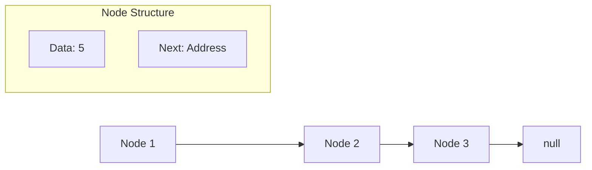
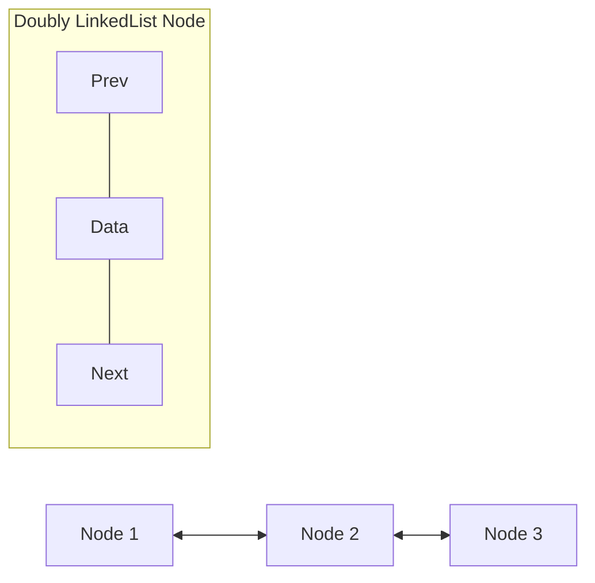

# Java Collections Framework

## Table of Contents

1. [Introduction to Collections](#introduction-to-collections)
2. [Collection Framework Components](#collection-framework-components)
3. [Types of Collections](#types-of-collections)
4. [ArrayList Implementation](#arraylist-implementation)
5. [Sorting Collections](#sorting-collections)

---

## Introduction to Collections

### What is a Collection?

- A **Collection** is a data structure that represents a group of objects or data. It serves as a container for managing multiple objects efficiently.
- Java Collections Framework provides interfaces, classes, and algorithms for efficient data manipulation

### Collection Framework Components

The Java Collections Framework consists of three main components:


### Collection Interfaces

**Purpose:** Provide abstract data types to represent collections

**Key Interface:** `Collection` (from java.util package)

- Root interface of the collection framework hierarchy
- Contains essential method declarations that every collection must implement
- Key methods: `size()`, `add()`, `iterator()`, `remove()`, `clear()`

**Main Interfaces:**

- **Set**: Extends Collection interface
- **List**: Extends Collection interface
- **Queue**: Extends Collection interface
- **Map**: Does NOT inherit from Collection interface but is part of the framework

**Location:** All interfaces are in the `java.util` package

### Algorithms

**Purpose:** Provide common functionalities through utility methods

**Key Operations:**

- Searching
- Sorting
- Shuffling
- Other collection manipulations


###  Collection  Hierarchy

[CollectionInterface](Java/core/Readme/Diagrams/CollectionInterfce.png)


---

## Types of Collections

Based on interfaces and classes, we get **four main flavors** of collections:

###  List

**Use Case:** Store ordered list of things (persons, vehicles, etc.)

- Maintains insertion order
- Allows duplicate elements
- Index-based access
- Implementation Classes: `ArrayList`, `Vector`, `LinkedList`

**When to Use:** When you need to store a list of items and maintain their order

###  Set

**Use Case:** Store unique elements only

- No duplicate elements allowed
- Implementation Classes: `HashSet`, `LinkedHashSet`, `TreeSet`

**When to Use:** When you need to ensure all elements are unique

### Queue

**Use Case:** Process elements in specific order (FIFO - First In, First Out)

- Elements processed in insertion order
- Implementation Classes: `LinkedList`, `PriorityQueue`

**When to Use:** When you need elements in the same order they were inserted

### Map

**Note**: Does NOT inherit from Collection interface but is part of the framework

**Use Case:** Store objects in key-value format

- Each element has a unique key
- Provides instant access using keys
- No iteration needed to access specific elements
- Implementation Classes: `Hashtable`, `HashMap`, `LinkedHashMap`, `TreeMap`

**When to Use:** When you need quick access to elements using a unique identifier

---

## Collection Characteristics

When choosing a collection, consider these characteristics:

### Ordered vs Unordered

- **Ordered Collection**: Maintains element order when added
- **Unordered Collection**: Does not maintain insertion order

### Sorted vs Unsorted

- **Sorted Collection**: Automatically sorts elements based on specific criteria
- **Unsorted Collection**: No automatic sorting

**Important Rule:** Implementation can never be sorted but unordered because sorting is a specific type of ordering.

### Examples:

- **HashSet**: Unordered and unsorted
- **LinkedHashSet**: Ordered but not sorted (maintains insertion order)
- **TreeSet**: Both ordered and sorted

### Natural Ordering

For automatic sorting, collections use **natural order**:

- **Strings**: Alphabetical order (A before B, Z after Y)
- **Integers**: Numeric order (1 before 2, etc.)
- **Custom Objects**: Must implement `Comparable` interface

---

## Real-World Scenario Analysis

**Scenario:** Store 1000 employee objects, each with ID, name, and designation. Later, fetch employee with ID 538.

### Solution Analysis:

**❌ List Approach:**

```java
// Problem: Need to iterate through entire list
for (Employee emp : employeeList) {
    if (emp.getId() == 538) {
        return emp; // Could require 1000 iterations in worst case
    }
}
```

**❌ Set Approach:**

- Same iteration problem as List
- Only benefit is uniqueness, but doesn't solve access efficiency

**✅ Map Approach (Recommended):**

```java
// Solution: Direct access using key
Map<Integer, Employee> employeeMap = new HashMap<>();
employeeMap.put(emp.getId(), emp); // Store with ID as key

Employee emp = employeeMap.get(538); // Direct access, no iteration!
```

**Performance Comparison:**

- List/Set: O(n) - Linear time complexity
- Map: O(1) - Constant time complexity for access

---

## L5:LinkedList Implementation

### Internal Structure and Design

**LinkedList** uses a different internal structure compared to ArrayList. Data is stored in a structure called **Node**.

### Node Structure

Each Node contains two parts:

1. **Data Part**: Stores the actual data/value
2. **Address Part**: Contains reference to the next node



### LinkedList Methods

```java
LinkedList<String> list = new LinkedList<>();

// Head and Tail operations
list.addFirst("First");        // Add at beginning
list.addLast("Last");          // Add at end (same as add())
list.getFirst();               // Get first element
list.getLast();                // Get last element
list.removeFirst();            // Remove first element
list.removeLast();             // Remove last element

// Peek operations (don't remove elements)
list.peekFirst();              // Get first without removing
list.peekLast();               // Get last without removing

// Poll operations (remove and return)
list.pollFirst();              // Remove and return first
list.pollLast();               // Remove and return last

list.remove();                 // Removes first element
list.remove("A");              // Removes specified element
```

### Singly vs Doubly LinkedList

#### Singly LinkedList

- **Two parts per node**: Data + Next node reference
- **Direction**: Can only traverse forward
- **Structure**: Data -> Next

#### Doubly LinkedList

- **Three parts per node**: Previous reference + Data + Next reference
- **Direction**: Can traverse both forward and backward
- **Structure**: Previous <- Data -> Next



### Performance Comparison: ArrayList vs LinkedList

| Operation                                 | ArrayList                        | LinkedList                     |
|-------------------------------------------|----------------------------------|--------------------------------|
| **Addition/Deletion at beginning/middle** | Slow O(n)                        | Fast O(1)                      |
| **Search Operations**                     | Fast O(1) random access          | Slow O(n) sequential access    |
| **Memory Usage**                          | Less overhead                    | More overhead (extra pointers) |
| **Best Use Case**                         | Frequent searching/random access | Frequent insertion/deletion    |

---

## L6:Vector Implementation

### Historical Context and Characteristics

**Vector** is one of the original collection classes in Java, along with Hashtable. Most other collections were added in Java 1.2 and 1.4.

### Key Differences from ArrayList

| Feature             | ArrayList          | Vector                          |
|---------------------|--------------------|---------------------------------|
| **Thread Safety**   | Not synchronized   | Synchronized (thread-safe)      |
| **Performance**     | Faster             | Slower (due to synchronization) |
| **Capacity Growth** | Increases by 50%   | Increases by 100% (doubles)     |
| **Legacy**          | Modern (Java 1.2+) | Legacy (Java 1.0)               |

### Capacity Growth Comparison

```java
// ArrayList capacity growth
// Initial: 10 -> When full -> 15 (50% increase)

// Vector capacity growth
// Initial: 10 -> When full -> 20 (100% increase)
```


### Thread Safety Example

```java
// Vector methods are synchronized
Vector<String> vector = new Vector<>();

// This is thread-safe but slower
vector.add("Thread Safe");

// ArrayList equivalent (not thread-safe but faster)
ArrayList<String> arrayList = new ArrayList<>();
arrayList.add("Not Thread Safe");

// For thread-safety with ArrayList, use:
List<String> synchronizedList = Collections.synchronizedList(new ArrayList<>());
```

**Alternative for Vector:**

```java
// Better approach for thread safety
List<String> threadSafeList = Collections.synchronizedList(new ArrayList<>());

// Or use concurrent collections
List<String> concurrentList = new CopyOnWriteArrayList<>();
```

---

### Comparison Table

| Feature                          | ArrayList                | LinkedList                  | Vector                     |
|----------------------------------|--------------------------|-----------------------------|----------------------------|
| **Internal Structure**           | Dynamic Array            | Doubly Linked Nodes         | Dynamic Array              |
| **Random Access**                | O(1)                     | O(n)                        | O(1)                       |
| **Insertion/Deletion at middle** | O(n)                     | O(1)                        | O(n)                       |
| **Memory Overhead**              | Low                      | High                        | Low                        |
| **Thread Safety**                | No                       | No                          | Yes                        |
| **Performance**                  | High                     | Medium                      | Low                        |
| **Best Use Case**                | Random access, searching | Frequent insertion/deletion | Legacy code, thread safety |


## Performance Considerations

| Collection Type | Access Time | Search Time | Insertion Time | Deletion Time |
|-----------------|-------------|-------------|----------------|---------------|
| ArrayList       | O(1)        | O(n)        | O(n)           | O(n)          |
| LinkedList      | O(n)        | O(n)        | O(1)           | O(1)          |
| HashMap         | O(1)        | O(1)        | O(1)           | O(1)          |
| TreeMap         | O(log n)    | O(log n)    | O(log n)       | O(log n)      |
