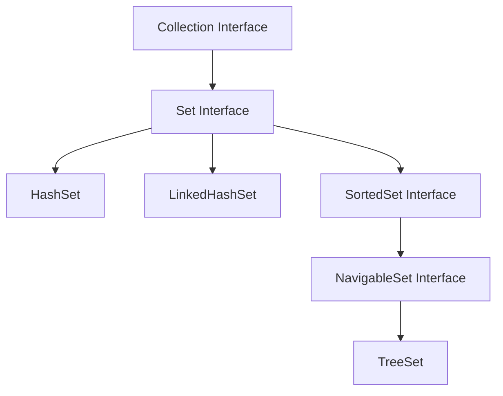

# Set

## Table of Contents
1. [Introduction to Sets](#introduction-to-sets)
2. [Set Interface Hierarchy](#set-interface-hierarchy)
3. [HashSet Implementation](#hashset-implementation)
4. [Working with Custom Objects](#working-with-custom-objects)
5. [The equals() and hashCode() Contract](#the-equals-and-hashcode-contract)
6. [LinkedHashSet - Maintaining Insertion Order](#linkedhashset---maintaining-insertion-order)
7. [TreeSet - Sorted Collection](#treeset---sorted-collection)
8. [Performance Comparison](#performance-comparison)
9. [Complete Working Examples](#complete-working-examples)

---

## Introduction to Sets

### Key Characteristics of Sets
- **Primary Purpose**: Ensure uniqueness - no duplicate elements allowed
- **Duplicate Detection**: Uses `equals()` method internally to determine if two objects are identical
- **Does not guarantee insertion order** (except for specific implementations)

### Set vs List Comparison
| Feature                | List         | Set                                         |
|------------------------|--------------|---------------------------------------------|
| **Duplicates**         | ✅ Allowed    | ❌ Not allowed                               |
| **Insertion Order**    | ✅ Maintained | ❌ Not guaranteed (implementation dependent) |
| **Index-based Access** | ✅ Available  | ❌ Not available                             |

## Set Interface Hierarchy



### Main Set Implementations
1. **HashSet** - Basic implementation, fastest performance
2. **LinkedHashSet** - Maintains insertion order using doubly-linked list
3. **TreeSet** - Automatically sorts elements using Red-Black tree structure

### Important Interfaces
- **SortedSet**: Provides sorting functionality
- **NavigableSet**: Provides navigation methods for sorted sets
- **TreeSet**: Implements both SortedSet and NavigableSet

## HashSet Implementation

### HashSet Characteristics
- Uses hash table for storage, providing fast O(1) average performance for basic operations
- No guaranteed order for elements
- Allows one null element
- Not synchronized (not thread-safe)
- Default capacity: 16, load factor: 0.75 (When 75% full, capacity automatically doubles)

### HashSet Constructors

```java
    // 1. Default constructor - capacity: 16, load factor: 0.75
    HashSet<String> set1 = new HashSet<>();
    
    // 2. With initial capacity - default load factor: 0.75
    HashSet<String> set2 = new HashSet<>(32);
    
    // 3. With capacity and load factor
    HashSet<String> set3 = new HashSet<>(32, 0.8f);
    
    // 4. From an existing collection
    HashSet<String> set4 = new HashSet<>(existingCollection);
```

### Essential HashSet Methods
- `add(element)` - Add element (returns boolean)
- `remove(element)` - Remove element (returns boolean)
- `contains(element)` - Check existence (returns boolean)
- `size()` - Get number of elements
- `isEmpty()` - Check if empty (returns boolean)
- `clear()` - Remove all elements
- `iterator()` - Get iterator for traversal
- `clone()` - Create shallow copy

## Working with Custom Objects

### The Challenge with Custom Objects
When working with custom objects like `Person`, the default `equals()` method from `Object` class only returns `true` if two reference variables point to the **same object instance**.

```java
// Problem example
Person p1 = new Person("John", 25);
Person p2 = new Person("John", 25);

// Without overriding equals():
// p1.equals(p2) returns false (different object instances)
// Set will treat them as different objects
```

### Why Override equals() is Necessary
If we override equals(), we must also override hashCode() due to the general contract, and failure to do so can lead to inconsistent behavior in hash-based collections.

## The equals() and hashCode() Contract

### The Contract Rules
The equals-hashCode contract states that if you override equals() method, you must override hashCode(), and if two objects are equal using equals(), they must return the same hash code.

#### Contract Details:
1. **Consistency**: If `a.equals(b)` returns `true`, then `a.hashCode() == b.hashCode()` must be `true`
2. **Reflexive**: `x.equals(x)` should return `true`
3. **Symmetric**: If `x.equals(y)` returns `true`, then `y.equals(x)` should return `true`
4. **Transitive**: If `x.equals(y)` and `y.equals(z)` both return `true`, then `x.equals(z)` should return `true`

### Implementation Strategy
1. **Choose Equality Criteria**: Decide which attributes determine equality
   - For `Person`: Maybe `name` or `id`
   - For `Employee`: Maybe `employeeId`
2. **Use Same Attributes**: Use the same attributes in both `equals()` and `hashCode()`
3. **Consider Null Values**: Handle null values properly

## LinkedHashSet - Maintaining Insertion Order

### LinkedHashSet Characteristics
- Extends HashSet but adds a doubly linked list to maintain insertion order, using more memory than HashSet
- Same performance as HashSet for basic operations
- Iteration order is predictable (insertion order)

### When to Use LinkedHashSet
- When you need Set functionality (no duplicates)
- When insertion order matters for iteration
- When you don't need sorting but want a predictable order

## TreeSet - Sorted Collection

### TreeSet Characteristics
- Automatically sorting them in ascending order
- **Only sorted collection** in Java Collections Framework (along with TreeMap)
- O(log n) performance for basic operations
- Cannot contain null elements
- Elements must implement `Comparable` or provide a `Comparator`

### TreeSet Requirements for Custom Objects
Custom objects must implement `Comparable<T>` interface and override `compareTo()` method:

```java
public class Person implements Comparable<Person> {
    private String name;
    private int age;
    
    @Override
    public int compareTo(Person other) {
        return this.name.compareTo(other.name); // Sort by name
    }
}
```

## Comparison of HashSet, LinkedHashSet, and TreeSet

| Operation       | HashSet      | LinkedHashSet      | TreeSet               |
|-----------------|--------------|--------------------|-----------------------|
| **Add**         | O(1) avg     | O(1) avg           | O(log n)              |
| **Remove**      | O(1) avg     | O(1) avg           | O(log n)              |
| **Contains**    | O(1) avg     | O(1) avg           | O(log n)              |
| **Iteration**   | O(n)         | O(n)               | O(n)                  |
| **Memory**      | Least        | More (linked list) | Most (tree structure) |
| **Order**       | No guarantee | Insertion order    | Sorted order          |
| **Performance** | Fastest      | Slightly slower    | Fastest               |

:point_right: In general, HashSet should have slightly better performance for basic operations like 
add, 
remove, and contains, while LinkedHashSet trades some of that performance for predictable iteration order.
For most practical applications, the performance difference between HashSet and LinkedHashSet is negligible unless you're dealing with extremely large sets or performance-critical operations.


## Critical Rules to Remember
1. **Always override both `equals()` and `hashCode()`** when working with custom objects in Sets
2. **Use the same attributes** in both methods to maintain the contract
3. **For TreeSet**, implement `Comparable<T>` or provide a `Comparator<T>`
4. **TreeSet cannot contain null elements**, while HashSet and LinkedHashSet can contain one null
5. **Consider using unique identifiers** (like ID fields) for equality rather than descriptive fields like names
