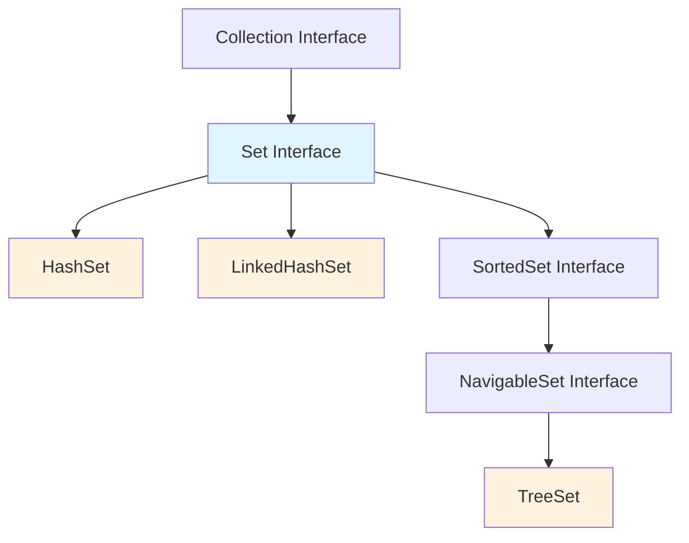

# Set

## Table of Contents
1. [Introduction to Sets](#introduction-to-sets)
2. [Set Interface Hierarchy](#set-interface-hierarchy)
3. [HashSet Implementation](#hashset-implementation)
4. [Working with Custom Objects](#working-with-custom-objects)
5. [The equals() and hashCode() Contract](#the-equals-and-hashcode-contract)
6. [LinkedHashSet - Maintaining Insertion Order](#linkedhashset---maintaining-insertion-order)
7. [TreeSet - Sorted Collection](#treeset---sorted-collection)
8. [Performance Comparison](#performance-comparison)
9. [Complete Working Examples](#complete-working-examples)

---

## Introduction to Sets

### Key Characteristics of Sets
- **Primary Purpose**: Ensure uniqueness - no duplicate elements allowed
- **Duplicate Detection**: Uses `equals()` method internally to determine if two objects are identical
- **Order**: **Does not guarantee insertion order** (except for specific implementations)

### Set vs List Comparison
| Feature | List | Set |
|---------|------|-----|
| **Duplicates** | ✅ Allowed | ❌ Not allowed |
| **Insertion Order** | ✅ Maintained | ❌ Not guaranteed (implementation dependent) |
| **Index-based Access** | ✅ Available | ❌ Not available |

---

## Set Interface Hierarchy



### Main Set Implementations
1. **HashSet** - Basic implementation, fastest performance
2. **LinkedHashSet** - Maintains insertion order using doubly-linked list
3. **TreeSet** - Automatically sorts elements using Red-Black tree structure

### Important Interfaces
- **SortedSet**: Provides sorting functionality
- **NavigableSet**: Provides navigation methods for sorted sets
- **TreeSet**: Implements both SortedSet and NavigableSet

---

## HashSet Implementation

### HashSet Characteristics
- Uses hash table for storage, providing fast O(1) average performance for basic operations
- No guaranteed order for elements
- Allows one null element
- Not synchronized (not thread-safe)

### HashSet Constructors

```java
// 1. Default constructor - capacity: 16, load factor: 0.75
HashSet<String> set1 = new HashSet<>();

// 2. With initial capacity - default load factor: 0.75
HashSet<String> set2 = new HashSet<>(32);

// 3. With capacity and load factor
HashSet<String> set3 = new HashSet<>(32, 0.8f);

// 4. From existing collection
HashSet<String> set4 = new HashSet<>(existingCollection);
```

### Load Factor Explained
- **Definition**: Measure of how full the HashSet can get before capacity increases
- **Default**: 0.75 (75%)
- **Behavior**: When 75% full, capacity automatically doubles
- **Trade-off**: Lower load factor = more memory but faster access

### Essential HashSet Methods
- `add(element)` - Add element (returns boolean)
- `remove(element)` - Remove element (returns boolean)
- `contains(element)` - Check existence (returns boolean)
- `size()` - Get number of elements
- `isEmpty()` - Check if empty (returns boolean)
- `clear()` - Remove all elements
- `iterator()` - Get iterator for traversal
- `clone()` - Create shallow copy

---

## Working with Custom Objects

### The Challenge with Custom Objects
When working with custom objects like `Person`, the default `equals()` method from `Object` class only returns `true` if two reference variables point to the **same object instance**.

```java
// Problem example
Person p1 = new Person("John", 25);
Person p2 = new Person("John", 25);

// Without overriding equals():
// p1.equals(p2) returns false (different object instances)
// Set will treat them as different objects
```

### Why Override equals() is Necessary
If we override equals(), we must also override hashCode() due to the general contract, and failure to do so can lead to inconsistent behavior in hash-based collections.

---

## The equals() and hashCode() Contract

### The Contract Rules
The equals-hashCode contract states that if you override equals() method, you must override hashCode(), and if two objects are equal using equals(), they must return the same hash code.

#### Contract Details:
1. **Consistency**: If `a.equals(b)` returns `true`, then `a.hashCode() == b.hashCode()` must be `true`
2. **Reflexive**: `x.equals(x)` should return `true`
3. **Symmetric**: If `x.equals(y)` returns `true`, then `y.equals(x)` should return `true`
4. **Transitive**: If `x.equals(y)` and `y.equals(z)` both return `true`, then `x.equals(z)` should return `true`

### Implementation Strategy
1. **Choose Equality Criteria**: Decide which attributes determine equality
   - For `Person`: Maybe `name` or `id`
   - For `Employee`: Maybe `employeeId`
2. **Use Same Attributes**: Use the same attributes in both `equals()` and `hashCode()`
3. **Consider Null Values**: Handle null values properly

---

## LinkedHashSet - Maintaining Insertion Order

### LinkedHashSet Characteristics
- Extends HashSet but adds a doubly-linked list to maintain insertion order, using more memory than HashSet
- Same performance as HashSet for basic operations
- Iteration order is predictable (insertion order)

### When to Use LinkedHashSet
- When you need Set functionality (no duplicates)
- When insertion order matters for iteration
- When you don't need sorting but want predictable order

---

## TreeSet - Sorted Collection

### TreeSet Characteristics
- Uses Red-Black Tree to store elements, automatically sorting them in ascending order
- **Only sorted collection** in Java Collections Framework (along with TreeMap)
- O(log n) performance for basic operations
- Cannot contain null elements
- Elements must implement `Comparable` or provide a `Comparator`

### TreeSet Requirements for Custom Objects
Custom objects must implement `Comparable<T>` interface and override `compareTo()` method:

```java
public class Person implements Comparable<Person> {
    private String name;
    private int age;
    
    @Override
    public int compareTo(Person other) {
        return this.name.compareTo(other.name); // Sort by name
    }
}
```

---

## Performance Comparison

| Operation | HashSet | LinkedHashSet | TreeSet |
|-----------|---------|---------------|---------|
| **Add** | O(1) avg | O(1) avg | O(log n) |
| **Remove** | O(1) avg | O(1) avg | O(log n) |
| **Contains** | O(1) avg | O(1) avg | O(log n) |
| **Iteration** | O(n) | O(n) | O(n) |
| **Memory** | Least | More (linked list) | Most (tree structure) |
| **Order** | No guarantee | Insertion order | Sorted order |

---

## Complete Working Examples

### Example 1: Basic HashSet Operations

```java
import java.util.*;

public class HashSetExample {
    public static void main(String[] args) {
        // Create HashSet
        HashSet<String> fruits = new HashSet<>();
        
        // Add elements
        fruits.add("Apple");
        fruits.add("Orange");
        fruits.add("Grape");
        fruits.add("Apple");    // Duplicate - will be ignored
        fruits.add("Orange");   // Duplicate - will be ignored
        
        System.out.println("HashSet contents:");
        for (String fruit : fruits) {
            System.out.println(fruit);
        }
        
        // Check size
        System.out.println("Size: " + fruits.size()); // Output: 3
        
        // Check if contains element
        System.out.println("Contains 'Apple': " + fruits.contains("Apple")); // true
        
        // Remove element
        fruits.remove("Grape");
        System.out.println("After removing 'Grape': " + fruits);
    }
}
```

**Expected Output:**
```
HashSet contents:
Apple
Orange
Grape
Size: 3
Contains 'Apple': true
After removing 'Grape': [Apple, Orange]
```

### Example 2: Custom Objects with equals() and hashCode()

```java
import java.util.*;

class Person {
    private String name;
    private int age;
    private String gender;
    
    // Constructor
    public Person(String name, int age, String gender) {
        this.name = name;
        this.age = age;
        this.gender = gender;
    }
    
    // Getter methods
    public String getName() { return name; }
    public int getAge() { return age; }
    public String getGender() { return gender; }
    
    // Override equals() - using name for equality
    @Override
    public boolean equals(Object obj) {
        if (this == obj) return true;
        if (obj == null || getClass() != obj.getClass()) return false;
        
        Person person = (Person) obj;
        return Objects.equals(name, person.name);
    }
    
    // Override hashCode() - using same attribute as equals()
    @Override
    public int hashCode() {
        return Objects.hash(name);
    }
    
    @Override
    public String toString() {
        return "Person{name='" + name + "', age=" + age + ", gender='" + gender + "'}";
    }
}

public class CustomObjectExample {
    public static void main(String[] args) {
        Set<Person> personSet = new HashSet<>();
        
        // Add persons
        personSet.add(new Person("Zia", 22, "Female"));
        personSet.add(new Person("Zia", 22, "Female")); // Duplicate name
        personSet.add(new Person("Alex", 24, "Male"));
        personSet.add(new Person("Zia", 30, "Female")); // Same name, different age
        
        System.out.println("Person Set (duplicates by name removed):");
        for (Person p : personSet) {
            System.out.println(p);
        }
        
        System.out.println("Set size: " + personSet.size()); // Output: 2
    }
}
```

**Expected Output:**
```
Person Set (duplicates by name removed):
Person{name='Alex', age=24, gender='Male'}
Person{name='Zia', age=22, gender='Female'}
Set size: 2
```

### Example 3: Comparing All Three Set Implementations

```java
import java.util.*;

public class SetComparison {
    public static void main(String[] args) {
        // Sample data
        String[] fruits = {"Grape", "Apple", "Orange", "Banana", "Apple", "Grape"};
        
        // HashSet - No order guarantee
        Set<String> hashSet = new HashSet<>();
        Collections.addAll(hashSet, fruits);
        System.out.println("HashSet (no order): " + hashSet);
        
        // LinkedHashSet - Maintains insertion order
        Set<String> linkedHashSet = new LinkedHashSet<>();
        Collections.addAll(linkedHashSet, fruits);
        System.out.println("LinkedHashSet (insertion order): " + linkedHashSet);
        
        // TreeSet - Sorted order
        Set<String> treeSet = new TreeSet<>();
        Collections.addAll(treeSet, fruits);
        System.out.println("TreeSet (sorted): " + treeSet);
        
        // Performance demonstration
        demonstratePerformance();
    }
    
    private static void demonstratePerformance() {
        System.out.println("\nPerformance Test (1 million operations):");
        int size = 1000000;
        
        // HashSet performance
        long start = System.currentTimeMillis();
        Set<Integer> hashSet = new HashSet<>();
        for (int i = 0; i < size; i++) {
            hashSet.add(i);
        }
        long hashSetTime = System.currentTimeMillis() - start;
        
        // LinkedHashSet performance
        start = System.currentTimeMillis();
        Set<Integer> linkedHashSet = new LinkedHashSet<>();
        for (int i = 0; i < size; i++) {
            linkedHashSet.add(i);
        }
        long linkedHashSetTime = System.currentTimeMillis() - start;
        
        // TreeSet performance
        start = System.currentTimeMillis();
        Set<Integer> treeSet = new TreeSet<>();
        for (int i = 0; i < size; i++) {
            treeSet.add(i);
        }
        long treeSetTime = System.currentTimeMillis() - start;
        
        System.out.println("HashSet time: " + hashSetTime + " ms");
        System.out.println("LinkedHashSet time: " + linkedHashSetTime + " ms");
        System.out.println("TreeSet time: " + treeSetTime + " ms");
    }
}
```

**Expected Output:**
```
HashSet (no order): [Apple, Grape, Orange, Banana]
LinkedHashSet (insertion order): [Grape, Apple, Orange, Banana]
TreeSet (sorted): [Apple, Banana, Grape, Orange]

Performance Test (1 million operations):
HashSet time: 145 ms
LinkedHashSet time: 167 ms
TreeSet time: 578 ms
```

### Example 4: TreeSet with Custom Objects

```java
import java.util.*;

class PersonComparable implements Comparable<PersonComparable> {
    private String name;
    private int age;
    private String gender;
    
    public PersonComparable(String name, int age, String gender) {
        this.name = name;
        this.age = age;
        this.gender = gender;
    }
    
    public String getName() { return name; }
    public int getAge() { return age; }
    public String getGender() { return gender; }
    
    // Required for TreeSet - defines natural ordering
    @Override
    public int compareTo(PersonComparable other) {
        return this.name.compareTo(other.name); // Sort by name
    }
    
    // Still need equals() and hashCode() for Set contract
    @Override
    public boolean equals(Object obj) {
        if (this == obj) return true;
        if (obj == null || getClass() != obj.getClass()) return false;
        PersonComparable person = (PersonComparable) obj;
        return Objects.equals(name, person.name);
    }
    
    @Override
    public int hashCode() {
        return Objects.hash(name);
    }
    
    @Override
    public String toString() {
        return "Person{name='" + name + "', age=" + age + ", gender='" + gender + "'}";
    }
}

public class TreeSetCustomExample {
    public static void main(String[] args) {
        TreeSet<PersonComparable> personSet = new TreeSet<>();
        
        // Add persons in random order
        personSet.add(new PersonComparable("Zia", 22, "Female"));
        personSet.add(new PersonComparable("Rome", 23, "Male"));
        personSet.add(new PersonComparable("Alex", 24, "Male"));
        personSet.add(new PersonComparable("Lucy", 21, "Female"));
        personSet.add(new PersonComparable("Bob", 25, "Male"));
        
        System.out.println("TreeSet (automatically sorted by name):");
        for (PersonComparable p : personSet) {
            System.out.println(p);
        }
        
        // Navigation methods available in TreeSet
        System.out.println("\nNavigation Methods:");
        System.out.println("First: " + personSet.first());
        System.out.println("Last: " + personSet.last());
        System.out.println("Higher than 'Lucy': " + personSet.higher(new PersonComparable("Lucy", 0, "")));
        System.out.println("Lower than 'Lucy': " + personSet.lower(new PersonComparable("Lucy", 0, "")));
    }
}
```

**Expected Output:**
```
TreeSet (automatically sorted by name):
Person{name='Alex', age=24, gender='Male'}
Person{name='Bob', age=25, gender='Male'}
Person{name='Lucy', age=21, gender='Female'}
Person{name='Rome', age=23, gender='Male'}
Person{name='Zia', age=22, gender='Female'}

Navigation Methods:
First: Person{name='Alex', age=24, gender='Male'}
Last: Person{name='Zia', age=22, gender='Female'}
Higher than 'Lucy': Person{name='Rome', age=23, gender='Male'}
Lower than 'Lucy': Person{name='Bob', age=25, gender='Male'}
```

---

## Key Takeaways and Best Practices

### When to Use Each Implementation
1. **HashSet**: 
   - Default choice for general-purpose Set operations
   - Best performance when order doesn't matter
   - Use when you need fastest add/remove/contains operations

2. **LinkedHashSet**: 
   - When you need Set functionality with predictable iteration order
   - Slight performance overhead compared to HashSet
   - Good compromise between HashSet and TreeSet

3. **TreeSet**: 
   - When you need sorted data
   - When you need navigation capabilities (first, last, higher, lower)
   - Accept O(log n) performance for sorting benefits

### Critical Rules to Remember
1. **Always override both `equals()` and `hashCode()`** when working with custom objects in Sets
2. **Use the same attributes** in both methods to maintain the contract
3. **For TreeSet**, implement `Comparable<T>` or provide a `Comparator<T>`
4. **TreeSet cannot contain null elements**, while HashSet and LinkedHashSet can contain one null
5. **Consider using unique identifiers** (like ID fields) for equality rather than descriptive fields like names

### Common Pitfalls to Avoid
- Overriding `equals()` without overriding `hashCode()`
- Using mutable objects as Set elements and then modifying them
- Forgetting to implement `Comparable` when using TreeSet with custom objects
- Relying on HashSet iteration order (it's not guaranteed)
- Using TreeSet when you don't need sorting (performance impact)