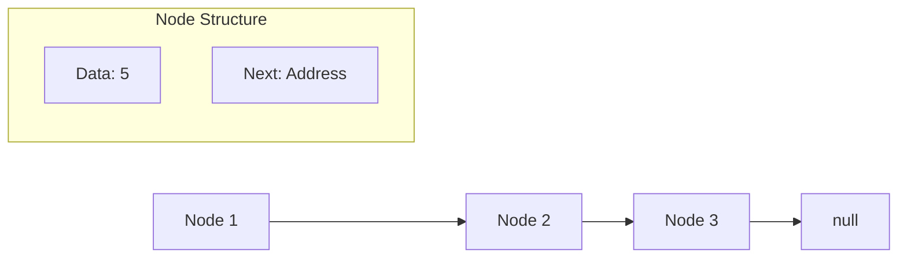
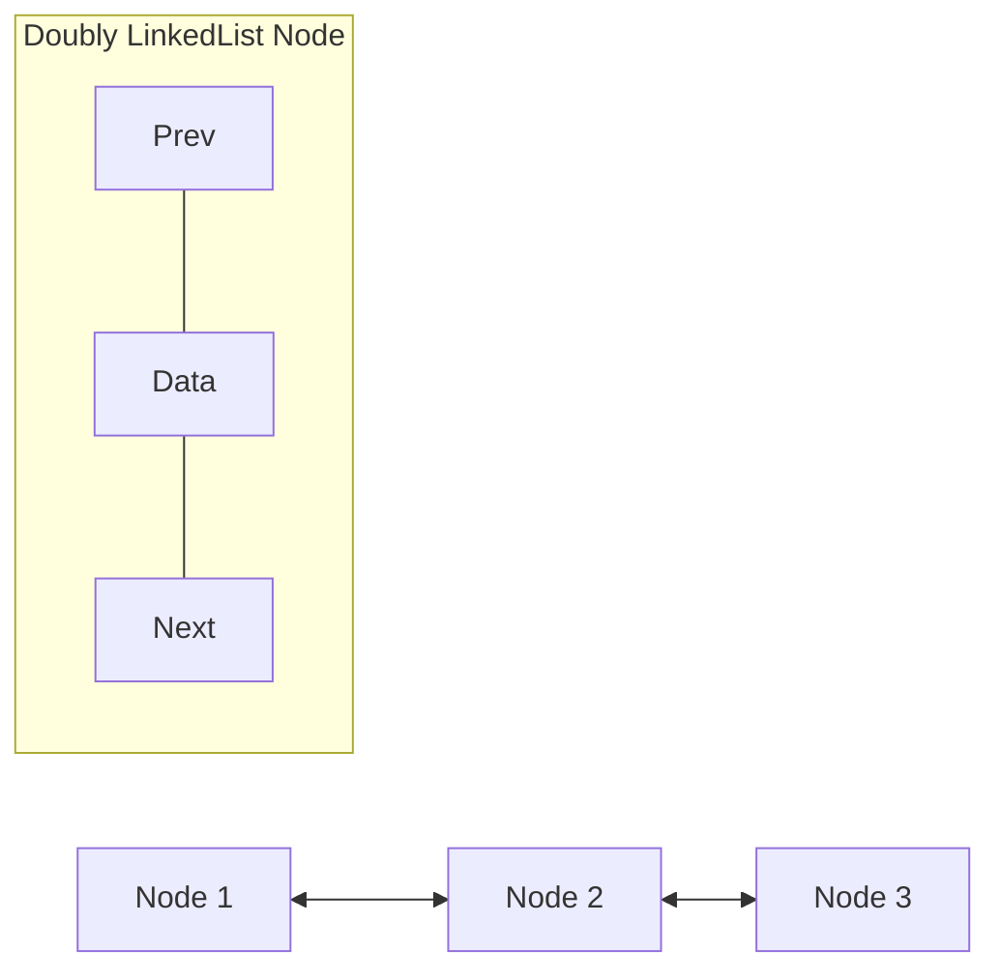

# L5:LinkedList Implementation

**Table of Contents**

- [Internal Structure and Design](#internal-structure-and-design)
- [Node Structure](#node-structure)
- [LinkedList Methods](#linkedlist-methods)
- [Singly vs Doubly LinkedList](#singly-vs-doubly-linkedlist)
    - [Singly LinkedList](#singly-linkedlist)
    - [Doubly LinkedList](#doubly-linkedlist)
- [Performance Comparison: ArrayList vs LinkedList](#performance-comparison-arraylist-vs-linkedlist)

### Internal Structure and Design

**LinkedList** uses a different internal structure compared to ArrayList. Data is stored in a structure called **Node**.

### Node Structure

Each Node contains two parts:

1. **Data Part**: Stores the actual data/value
2. **Address Part**: Contains reference to the next node



### LinkedList Methods

```java
LinkedList<String> list = new LinkedList<>();

// Head and Tail operations
list.addFirst("First");        // Add at beginning
list.addLast("Last");          // Add at end (same as add())
list.getFirst();               // Get first element
list.getLast();                // Get last element
list.removeFirst();            // Remove first element
list.removeLast();             // Remove last element

// Peek operations (don't remove elements)
list.peekFirst();              // Get first without removing
list.peekLast();               // Get last without removing

// Poll operations (remove and return)
list.pollFirst();              // Remove and return first
list.pollLast();               // Remove and return last

list.remove();                 // Removes first element
list.remove("A");              // Removes specified element
```

### Singly vs Doubly LinkedList

#### Singly LinkedList

- **Two parts per node**: Data + Next node reference
- **Direction**: Can only traverse forward
- **Structure**: Data -> Next

#### Doubly LinkedList

- **Three parts per node**: Previous reference + Data + Next reference
- **Direction**: Can traverse both forward and backward
- **Structure**: Previous <- Data -> Next



### Performance Comparison: ArrayList vs LinkedList

| Operation                                 | ArrayList                        | LinkedList                     |
|-------------------------------------------|----------------------------------|--------------------------------|
| **Addition/Deletion at beginning/middle** | Slow O(n)                        | Fast O(1)                      |
| **Search Operations**                     | Fast O(1) random access          | Slow O(n) sequential access    |
| **Memory Usage**                          | Less overhead                    | More overhead (extra pointers) |
| **Best Use Case**                         | Frequent searching/random access | Frequent insertion/deletion    |

---
