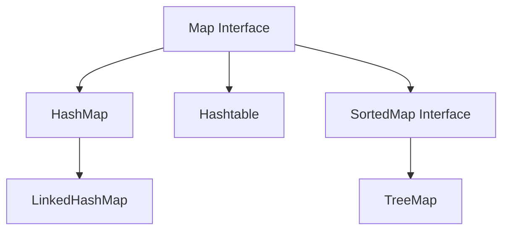
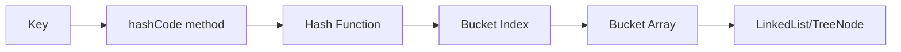
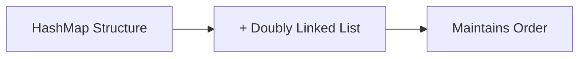
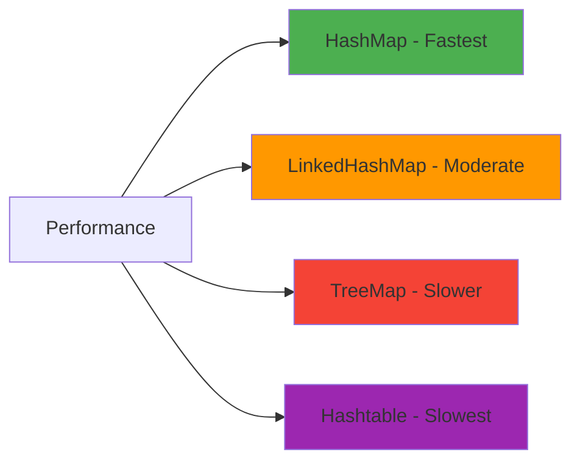

# Java Map Collection

## Table of Contents
1. [Map Interface Overview](#map-interface-overview)
2. [Map Hierarchy](#map-hierarchy)
3. [HashMap - Deep Dive](#hashmap---deep-dive)
4. [HashMap Internal Working](#hashmap-internal-working)
5. [Hashtable](#hashtable)
6. [LinkedHashMap](#linkedhashmap)
7. [TreeMap](#treemap)
8. [Comparison of Map Implementations](#comparison-of-map-implementations)

## Map Interface Overview

The Map interface is a fundamental part of the Java Collections Framework that stores data in **key-value pairs**. Here are its key characteristics:

### Key Features:
- **Does NOT extend Collection interface** - Map is a separate hierarchy
- Stores elements as **key-value pairs**
- **Keys must be unique** - duplicate keys are not allowed
- **Direct access** to values using keys (no need to iterate)
- Relies on **equals()** method to compare keys
- Uses **hashing** mechanism for efficient storage and retrieval

### Core Methods:
- `put(K key, V value)` - Add/update key-value pair
- `get(Object key)` - Retrieve value by key
- `remove(Object key)` - Remove entry by key
- `containsKey(Object key)` - Check if key exists
- `containsValue(Object value)` - Check if value exists
- `keySet()` - Get all keys
- `values()` - Get all values
- `entrySet()` - Get all key-value pairs
- `size()` - Get number of entries

## Map Hierarchy

### Implementation Classes:
- **HashMap** - Unsorted, unordered, fastest
- **LinkedHashMap** - Maintains insertion order
- **TreeMap** - Sorted by keys (natural or custom order)
- **Hashtable** - Synchronized version of HashMap (legacy)

## HashMap - Deep Dive

HashMap is the most commonly used Map implementation, providing O(1) average time complexity for basic operations.

### Key Characteristics:
- **Not synchronized** - Not thread-safe
- **Allows one null key** and multiple null values
- **No guaranteed order** of elements
- **Best performance** for basic operations
- **Initial capacity**: 16 buckets
- **Load factor**: 0.75 (resizes when 75% full)
- **Duplicate Keys**: value get over-written, keys must be unique 

### When to Use HashMap:
- When you need fast access to data
- Order doesn't matter
- Single-threaded environment
- Most common choice for general use

## HashMap Internal Working

HashMap uses the concept of hashing to store key-value pairs efficiently. Internally, it consists of an array of buckets, where each bucket can store a linked list or binary tree of entries.

### Hashing Process:

### Step-by-Step Process:

1. **Key Processing**: When you call `put(key, value)`
2. **Hash Code Generation**: `key.hashCode()` is called
3. **Index Calculation**: Hash code is converted to bucket index
4. **Storage**: Key-value pair stored in the bucket
5. **Collision Handling**: If multiple keys hash to same bucket, they form a linked list. When a bucket becomes too big (more than 8 elements), HashMap replaces the linked list with a TreeMap for better performance (O(log n) instead of O(n)).

## Hashtable

Hashtable is the synchronized counterpart of HashMap, making it thread-safe but slower.

### Key Characteristics:
- **Synchronized** - All methods are thread-safe
- **No null values** allowed for keys or values
- **Legacy class** - Part of Java since JDK 1.0
- **Slower performance** due to synchronization overhead
- **Extends Dictionary class** (legacy)

## LinkedHashMap

LinkedHashMap maintains the insertion order of elements using a doubly-linked list.

### Key Characteristics:
- **Maintains insertion order**
- **Slightly slower** for put/remove operations
- **Faster iteration** compared to HashMap
- **Allows null key/values**
- **Not synchronized**

### Internal Structure:

### When to Use:
- When you need to maintain insertion order
- For cache implementations (LRU cache)
- When iteration performance is important

## TreeMap

TreeMap is a sorted map implementation that maintains elements in sorted order of keys.

### Key Characteristics:
- **Sorted order** - Keys are always sorted
- **Red-Black Tree** implementation
- **O(log n)** time complexity for basic operations
- **No null keys** allowed (throws NullPointerException)
- **Implements SortedMap interface**

### Sorting Options:
1. **Natural ordering** - Keys implement Comparable
2. **Custom ordering** - Provide Comparator in constructor

### When to Use:
- When you need sorted keys
- Range queries (subMap, headMap, tailMap)
- Finding min/max keys
- Navigational operations

## Comparison of Map Implementations

| Feature             | HashMap               | LinkedHashMap    | TreeMap          | Hashtable   |
|---------------------|-----------------------|------------------|------------------|-------------|
| **Ordering**        | No order              | Insertion order  | Sorted order     | No order    |
| **Null Keys**       | One allowed           | One allowed      | Not allowed      | Not allowed |
| **Null Values**     | Multiple allowed      | Multiple allowed | Multiple allowed | Not allowed |
| **Synchronization** | No                    | No               | No               | Yes         |
| **Time Complexity** | O(1)                  | O(1)             | O(log n)         | O(1)        |
| **Best Use Case**   | General purpose, Fast | Maintain order   | Sorted data      | Thread-safe |

### Performance Comparison:

### Best Practices:

1. **Always override hashCode() and equals()** when using custom objects as keys
2. **Use appropriate initial capacity** for HashMap to avoid resizing
3. **Consider ConcurrentHashMap** instead of Hashtable for thread-safety
4. **Prefer forEach() or entrySet()** for iteration over keySet()
