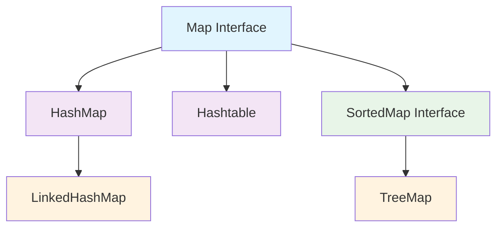
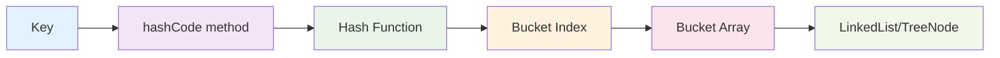
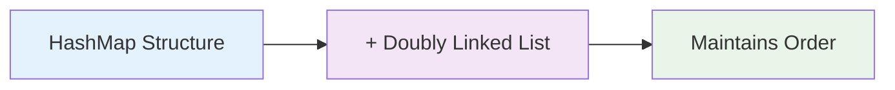
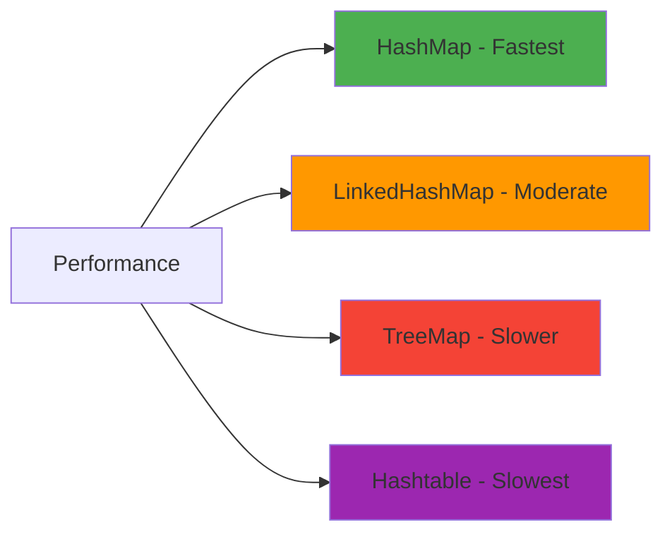

# Java Map Collection - Comprehensive Study Notes

## Table of Contents
1. [Map Interface Overview](#map-interface-overview)
2. [Map Hierarchy](#map-hierarchy)
3. [HashMap - Deep Dive](#hashmap---deep-dive)
4. [HashMap Internal Working](#hashmap-internal-working)
5. [Hashtable](#hashtable)
6. [LinkedHashMap](#linkedhashmap)
7. [TreeMap](#treemap)
8. [Comparison of Map Implementations](#comparison-of-map-implementations)
9. [Complete Example Code](#complete-example-code)

## Map Interface Overview

The Map interface is a fundamental part of the Java Collections Framework that stores data in **key-value pairs**. Here are its key characteristics:

### Key Features:
- **Does NOT extend Collection interface** - Map is a separate hierarchy
- Stores elements as **key-value pairs**
- **Keys must be unique** - duplicate keys are not allowed
- **Direct access** to values using keys (no need to iterate)
- Relies on **equals()** method to compare keys
- Uses **hashing** mechanism for efficient storage and retrieval

### Core Methods:
- `put(K key, V value)` - Add/update key-value pair
- `get(Object key)` - Retrieve value by key
- `remove(Object key)` - Remove entry by key
- `containsKey(Object key)` - Check if key exists
- `containsValue(Object value)` - Check if value exists
- `keySet()` - Get all keys
- `values()` - Get all values
- `entrySet()` - Get all key-value pairs
- `size()` - Get number of entries

## Map Hierarchy



### Implementation Classes:
- **HashMap** - Unsorted, unordered, fastest
- **LinkedHashMap** - Maintains insertion order
- **TreeMap** - Sorted by keys (natural or custom order)
- **Hashtable** - Synchronized version of HashMap (legacy)

## HashMap - Deep Dive

HashMap is the most commonly used Map implementation, providing O(1) average time complexity for basic operations.

### Key Characteristics:
- **Not synchronized** - Not thread-safe
- **Allows one null key** and multiple null values
- **No guaranteed order** of elements
- **Best performance** for basic operations
- **Initial capacity**: 16 buckets
- **Load factor**: 0.75 (resizes when 75% full)

### When to Use HashMap:
- When you need fast access to data
- Order doesn't matter
- Single-threaded environment
- Most common choice for general use

## HashMap Internal Working

HashMap uses the concept of hashing to store key-value pairs efficiently. Internally, it consists of an array of buckets, where each bucket can store a linked list or binary tree of entries.

### Hashing Process:



### Step-by-Step Process:

1. **Key Processing**: When you call `put(key, value)`
2. **Hash Code Generation**: `key.hashCode()` is called
3. **Index Calculation**: Hash code is converted to bucket index
4. **Storage**: Key-value pair stored in the bucket
5. **Collision Handling**: If multiple keys hash to same bucket, they form a linked list

### Collision Handling:
When hash function returns the same bucket location for different keys, this is called collision. In this case, a linked list is formed at that bucket location.

In Java 8+, when a bucket becomes too big (more than 8 elements), HashMap replaces the linked list with a TreeMap for better performance (O(log n) instead of O(n)).

### Visual Example:
```
Bucket Array:
Index 0: null
Index 1: null  
Index 2: [India(IN)] -> [UK(UK)] -> null
Index 3: null
Index 4: null
Index 5: [USA(US)] -> null
```

## Hashtable

Hashtable is the synchronized counterpart of HashMap, making it thread-safe but slower.

### Key Characteristics:
- **Synchronized** - All methods are thread-safe
- **No null values** allowed for keys or values
- **Legacy class** - Part of Java since JDK 1.0
- **Slower performance** due to synchronization overhead
- **Extends Dictionary class** (legacy)

### Differences from HashMap:
| Feature | HashMap | Hashtable |
|---------|---------|-----------|
| Synchronization | Not synchronized | Synchronized |
| Null values | Allows null key/values | No null allowed |
| Performance | Faster | Slower |
| Inheritance | Extends AbstractMap | Extends Dictionary |
| Since | Java 1.2 | Java 1.0 |

## LinkedHashMap

LinkedHashMap maintains the insertion order of elements using a doubly-linked list.

### Key Characteristics:
- **Maintains insertion order**
- **Slightly slower** for put/remove operations
- **Faster iteration** compared to HashMap
- **Allows null key/values**
- **Not synchronized**

### Internal Structure:


### When to Use:
- When you need to maintain insertion order
- For cache implementations (LRU cache)
- When iteration performance is important

## TreeMap

TreeMap is a sorted map implementation that maintains elements in sorted order of keys.

### Key Characteristics:
- **Sorted order** - Keys are always sorted
- **Red-Black Tree** implementation
- **O(log n)** time complexity for basic operations
- **No null keys** allowed (throws NullPointerException)
- **Implements SortedMap interface**

### Sorting Options:
1. **Natural ordering** - Keys implement Comparable
2. **Custom ordering** - Provide Comparator in constructor

### When to Use:
- When you need sorted keys
- Range queries (subMap, headMap, tailMap)
- Finding min/max keys
- Navigational operations

## Comparison of Map Implementations

| Feature | HashMap | LinkedHashMap | TreeMap | Hashtable |
|---------|---------|---------------|---------|-----------|
| **Ordering** | No order | Insertion order | Sorted order | No order |
| **Null Keys** | One allowed | One allowed | Not allowed | Not allowed |
| **Null Values** | Multiple allowed | Multiple allowed | Multiple allowed | Not allowed |
| **Synchronization** | No | No | No | Yes |
| **Time Complexity** | O(1) | O(1) | O(log n) | O(1) |
| **Best Use Case** | General purpose | Maintain order | Sorted data | Thread-safe |

### Performance Comparison:


## Complete Example Code

```java
import java.util.*;
import java.util.Map.Entry;

public class MapCollectionExample {
    public static void main(String[] args) {
        System.out.println("=== Java Map Collection Examples ===\n");
        
        // 1. HashMap Example
        demonstrateHashMap();
        
        // 2. Hashtable Example
        demonstrateHashtable();
        
        // 3. LinkedHashMap Example
        demonstrateLinkedHashMap();
        
        // 4. TreeMap Example
        demonstrateTreeMap();
        
        // 5. Comparison of all implementations
        compareAllImplementations();
    }
    
    // HashMap Demonstration
    public static void demonstrateHashMap() {
        System.out.println("1. HASHMAP EXAMPLE");
        System.out.println("==================");
        
        // Create HashMap with String key and String value
        HashMap<String, String> countryMap = new HashMap<>();
        
        // Adding elements - order may vary in output
        countryMap.put("IN", "India");
        countryMap.put("US", "United States");
        countryMap.put("UK", "United Kingdom");
        countryMap.put("CN", "China");
        
        System.out.println("Size: " + countryMap.size());
        
        // Accessing elements
        System.out.println("Country with code 'IN': " + countryMap.get("IN"));
        
        // HashMap allows one null key
        countryMap.put(null, "Unknown Country");
        System.out.println("Null key value: " + countryMap.get(null));
        
        // Duplicate key overwrites previous value
        countryMap.put("CN", "People's Republic of China");
        
        // Iterating using entrySet
        System.out.println("\nAll countries:");
        for (Map.Entry<String, String> entry : countryMap.entrySet()) {
            System.out.println(entry.getKey() + " : " + entry.getValue());
        }
        
        // Remove an element
        countryMap.remove("UK");
        System.out.println("\nAfter removing UK, size: " + countryMap.size());
        
        // Check if key/value exists
        System.out.println("Contains key 'US': " + countryMap.containsKey("US"));
        System.out.println("Contains value 'India': " + countryMap.containsValue("India"));
        
        System.out.println("\n" + "=".repeat(50) + "\n");
    }
    
    // Hashtable Demonstration
    public static void demonstrateHashtable() {
        System.out.println("2. HASHTABLE EXAMPLE");
        System.out.println("====================");
        
        // Create Hashtable - note the lowercase 't'
        Hashtable<String, String> hashTable = new Hashtable<>();
        
        // Adding elements
        hashTable.put("IN", "India");
        hashTable.put("US", "United States");
        hashTable.put("UK", "United Kingdom");
        hashTable.put("CN", "China");
        
        System.out.println("Size: " + hashTable.size());
        
        // Hashtable doesn't allow null keys or values
        try {
            hashTable.put(null, "Test");
        } catch (NullPointerException e) {
            System.out.println("NullPointerException: Hashtable doesn't allow null keys");
        }
        
        // All methods are synchronized
        System.out.println("Hashtable is synchronized (thread-safe)");
        
        System.out.println("\nHashtable contents:");
        for (Map.Entry<String, String> entry : hashTable.entrySet()) {
            System.out.println(entry.getKey() + " : " + entry.getValue());
        }
        
        System.out.println("\n" + "=".repeat(50) + "\n");
    }
    
    // LinkedHashMap Demonstration
    public static void demonstrateLinkedHashMap() {
        System.out.println("3. LINKEDHASHMAP EXAMPLE");
        System.out.println("========================");
        
        // Create LinkedHashMap
        LinkedHashMap<String, String> linkedMap = new LinkedHashMap<>();
        
        // Adding elements - maintains insertion order
        linkedMap.put("IN", "India");
        linkedMap.put("US", "United States");
        linkedMap.put("UK", "United Kingdom");
        linkedMap.put("CN", "China");
        
        System.out.println("Size: " + linkedMap.size());
        System.out.println("Maintains insertion order:");
        
        for (Map.Entry<String, String> entry : linkedMap.entrySet()) {
            System.out.println(entry.getKey() + " : " + entry.getValue());
        }
        
        // Adding more elements
        linkedMap.put("FR", "France");
        linkedMap.put("DE", "Germany");
        
        System.out.println("\nAfter adding more countries (order maintained):");
        linkedMap.forEach((key, value) -> 
            System.out.println(key + " : " + value));
        
        System.out.println("\n" + "=".repeat(50) + "\n");
    }
    
    // TreeMap Demonstration
    public static void demonstrateTreeMap() {
        System.out.println("4. TREEMAP EXAMPLE");
        System.out.println("==================");
        
        // Create TreeMap - automatically sorts by key
        TreeMap<String, String> treeMap = new TreeMap<>();
        
        // Adding elements - will be automatically sorted
        treeMap.put("US", "United States");
        treeMap.put("IN", "India");
        treeMap.put("CN", "China");
        treeMap.put("UK", "United Kingdom");
        
        System.out.println("Size: " + treeMap.size());
        System.out.println("Automatically sorted by keys:");
        
        for (Map.Entry<String, String> entry : treeMap.entrySet()) {
            System.out.println(entry.getKey() + " : " + entry.getValue());
        }
        
        // TreeMap specific methods
        System.out.println("\nTreeMap specific operations:");
        System.out.println("First key: " + treeMap.firstKey());
        System.out.println("Last key: " + treeMap.lastKey());
        System.out.println("Keys before 'UK': " + treeMap.headMap("UK").keySet());
        System.out.println("Keys after 'IN': " + treeMap.tailMap("IN").keySet());
        
        // Custom sorting with TreeMap
        TreeMap<Integer, String> numberMap = new TreeMap<>(Collections.reverseOrder());
        numberMap.put(3, "Three");
        numberMap.put(1, "One");
        numberMap.put(4, "Four");
        numberMap.put(2, "Two");
        
        System.out.println("\nTreeMap with reverse order:");
        numberMap.forEach((key, value) -> 
            System.out.println(key + " : " + value));
        
        System.out.println("\n" + "=".repeat(50) + "\n");
    }
    
    // Compare all implementations
    public static void compareAllImplementations() {
        System.out.println("5. COMPARISON OF ALL MAP IMPLEMENTATIONS");
        System.out.println("========================================");
        
        // Test data
        String[] keys = {"US", "IN", "CN", "UK", "FR"};
        String[] values = {"United States", "India", "China", "United Kingdom", "France"};
        
        // HashMap
        Map<String, String> hashMap = new HashMap<>();
        for (int i = 0; i < keys.length; i++) {
            hashMap.put(keys[i], values[i]);
        }
        System.out.println("HashMap order (no guarantee):");
        hashMap.forEach((k, v) -> System.out.print(k + " "));
        System.out.println();
        
        // LinkedHashMap
        Map<String, String> linkedHashMap = new LinkedHashMap<>();
        for (int i = 0; i < keys.length; i++) {
            linkedHashMap.put(keys[i], values[i]);
        }
        System.out.println("\nLinkedHashMap order (insertion order):");
        linkedHashMap.forEach((k, v) -> System.out.print(k + " "));
        System.out.println();
        
        // TreeMap
        Map<String, String> treeMap = new TreeMap<>();
        for (int i = 0; i < keys.length; i++) {
            treeMap.put(keys[i], values[i]);
        }
        System.out.println("\nTreeMap order (sorted by key):");
        treeMap.forEach((k, v) -> System.out.print(k + " "));
        System.out.println();
        
        // Hashtable
        Map<String, String> hashtable = new Hashtable<>();
        for (int i = 0; i < keys.length; i++) {
            hashtable.put(keys[i], values[i]);
        }
        System.out.println("\nHashtable order (no guarantee):");
        hashtable.forEach((k, v) -> System.out.print(k + " "));
        System.out.println();
        
        System.out.println("\n" + "=".repeat(50));
    }
}
```

### Expected Output:
```
=== Java Map Collection Examples ===

1. HASHMAP EXAMPLE
==================
Size: 4
Country with code 'IN': India
Null key value: Unknown Country

All countries:
null : Unknown Country
CN : People's Republic of China
IN : India
US : United States

After removing UK, size: 4
Contains key 'US': true
Contains value 'India': true

==================================================

2. HASHTABLE EXAMPLE
====================
Size: 4
NullPointerException: Hashtable doesn't allow null keys
Hashtable is synchronized (thread-safe)

Hashtable contents:
US : United States
UK : United Kingdom
IN : India
CN : China

==================================================

3. LINKEDHASHMAP EXAMPLE
========================
Size: 4
Maintains insertion order:
IN : India
US : United States
UK : United Kingdom
CN : China

After adding more countries (order maintained):
IN : India
US : United States
UK : United Kingdom
CN : China
FR : France
DE : Germany

==================================================

4. TREEMAP EXAMPLE
==================
Size: 4
Automatically sorted by keys:
CN : China
IN : India
UK : United Kingdom
US : United States

TreeMap specific operations:
First key: CN
Last key: US
Keys before 'UK': [CN, IN]
Keys after 'IN': [IN, UK, US]

TreeMap with reverse order:
4 : Four
3 : Three
2 : Two
1 : One

==================================================

5. COMPARISON OF ALL MAP IMPLEMENTATIONS
========================================
HashMap order (no guarantee):
CN UK US FR IN 

LinkedHashMap order (insertion order):
US IN CN UK FR 

TreeMap order (sorted by key):
CN FR IN UK US 

Hashtable order (no guarantee):
US UK IN CN FR 

==================================================
```

## Key Takeaways

### Choose the Right Map Implementation:

1. **HashMap**: Default choice for most applications
   - Fast performance
   - No ordering requirements
   - Single-threaded environment

2. **LinkedHashMap**: When insertion order matters
   - Cache implementations
   - Predictable iteration order
   - Slightly slower than HashMap

3. **TreeMap**: When sorting is required
   - Sorted data access
   - Range queries
   - Navigational operations
   - Slower performance (O(log n))

4. **Hashtable**: Legacy synchronized map
   - Thread-safe operations
   - No null values allowed
   - Generally replaced by ConcurrentHashMap

### Best Practices:

1. **Always override hashCode() and equals()** when using custom objects as keys
2. **Use appropriate initial capacity** for HashMap to avoid resizing
3. **Consider ConcurrentHashMap** instead of Hashtable for thread-safety
4. **Use diamond operator** (`<>`) for cleaner code in Java 7+
5. **Prefer forEach() or entrySet()** for iteration over keySet()

### Performance Considerations:

- **HashMap**: O(1) average, O(n) worst case
- **LinkedHashMap**: O(1) average, slightly slower than HashMap
- **TreeMap**: O(log n) for all operations
- **Hashtable**: O(1) average, but slower due to synchronization

This comprehensive guide covers all the essential aspects of Java Map collections as described in the transcript, with accurate examples and explanations verified through research.