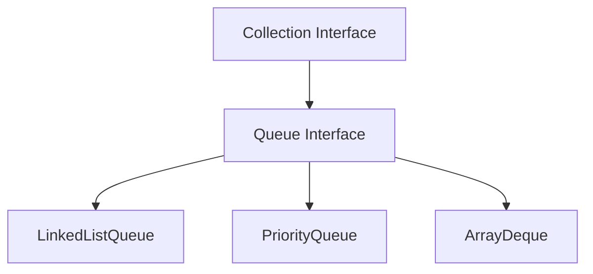
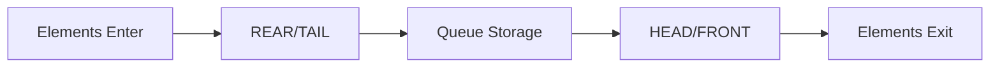

# Java Queue Interface - Complete Study Notes

## 1. Overview

The Queue interface is a fundamental part of Java's Collections Framework, extending the Collection interface. 
It follows the FIFO (First In, First Out) rule—the first element added to the queue is the first to be removed.

### Key Characteristics:
- **FIFO Ordering**: Elements are processed in the order they were inserted
- **No Random Access**: Unlike List, elements cannot be accessed directly by index
- **Allows Duplicates**: Can contain duplicate elements
- **Dynamic Size**: Automatically resizes based on the number of elements
- **Use generics** to ensure type safety

## Queue Hierarchy

## Core Queue Operations

### Terminology:
- **Enqueue**: Adding an element to the queue (rear/tail)
- **Dequeue**: Removing an element from the queue (front/head)
- **Head/Peek**: The first element in the queue (next to be removed)
- **Tail/Rear**: The last element in the queue (most recently added)

### Queue Operation Flow:

## Queue Method Categories

The Queue interface provides two forms of methods for insertion, removal, and inspection operations:

| Operation   | Exception Method | Safe Method | Behavior on Empty Queue          |
|-------------|------------------|-------------|----------------------------------|
| **Insert**  | `add(e)`         | `offer(e)`  | Throws exception vs Returns null |
| **Remove**  | `remove()`       | `poll()`    | Throws exception vs Returns null |
| **Examine** | `element()`      | `peek()`    | Returns null vs Returns false    |

### Method Differences:
- The `remove()` and `poll()` methods differ only in their behavior when the queue is empty: the `remove()` method throws an exception, while the `poll()` method returns `null`
- The `element()` and `peek()` methods return, but do not remove, the head of the queue

## Implementation Approaches

### LinkedList Queue Implementation (FIFO Order)

LinkedList Queue implements the Queue interface, providing first in, first out (FIFO) queue operations. This maintains insertion order.

### PriorityQueue Implementation (Natural Ordering)

The PriorityQueue class is a priority queue based on the heap data structure. This queue orders elements according to the order specified. PriorityQueue does not care about FIFO / LIFO. it handles priority.

### LinkedListQueue vs PriorityQueue Characteristics

| Aspect          | LinkedListQueue        | PriorityQueue             |
|-----------------|------------------------|---------------------------|
| **Ordering**    | FIFO (insertion order) | Natural ordering (sorted) |
| **Performance** | O(1) add/remove        | O(log n) add/remove       |
| **Use Case**    | Basic unbounded queue  | Priority-based processing |
| **Memory**      | More memory overhead   | Compact heap structure    |

## Real-World Applications

- **Task Scheduling**: Using PriorityQueue for priority-based task execution
- **Breadth-First Search**: Using LinkedList queue for BFS traversal
- **Print Queue**: Managing print jobs in FIFO order
- **Buffer Management**: Handling streaming data with bounded queues