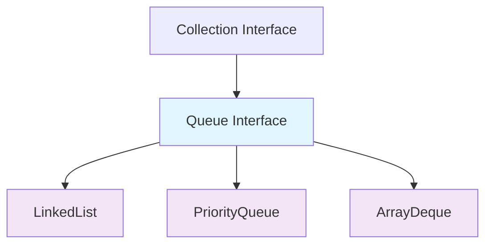
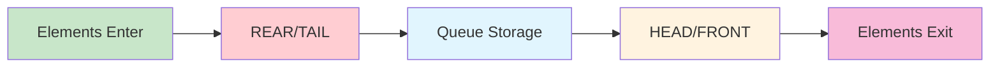

# Java Queue Interface - Complete Study Notes

## 1. Overview

The Queue interface is a fundamental part of Java's Collections Framework, extending the Collection interface. It follows the FIFO (First In, First Out) rule—the first element added to the queue is the first to be removed.

### Key Characteristics:
- **FIFO Ordering**: Elements are processed in the order they were inserted
- **No Random Access**: Unlike List, elements cannot be accessed directly by index
- **Allows Duplicates**: Can contain duplicate elements
- **Dynamic Size**: Automatically resizes based on the number of elements

## 2. Queue Hierarchy



## 3. Core Queue Operations

### Terminology:
- **Enqueue**: Adding an element to the queue (rear/tail)
- **Dequeue**: Removing an element from the queue (front/head)
- **Head/Peek**: The first element in the queue (next to be removed)
- **Tail/Rear**: The last element in the queue (most recently added)

### Queue Operation Flow:



## 4. Queue Method Categories

The Queue interface provides two forms of methods for insertion, removal, and inspection operations:

| Operation | Throws Exception | Returns Special Value |
|-----------|------------------|----------------------|
| **Insert** | `add(e)` | `offer(e)` |
| **Remove** | `remove()` | `poll()` |
| **Examine** | `element()` | `peek()` |

### Method Differences:
- The remove() and poll() methods differ only in their behavior when the queue is empty: the remove() method throws an exception, while the poll() method returns null
- The element() and peek() methods return, but do not remove, the head of the queue

## 5. Implementation Approaches

### 5.1 LinkedList Implementation (FIFO Order)

LinkedList implements the Queue interface, providing first in, first out (FIFO) queue operations. This maintains insertion order.

**Characteristics:**
- Maintains insertion order
- Unbounded queue
- Good for basic FIFO operations

### 5.2 PriorityQueue Implementation (Natural Ordering)

The PriorityQueue class is a priority queue based on the heap data structure. This queue orders elements according to the order specified. PriorityQueue does not care about FIFO / LIFO. it handles priority.

**Characteristics:**
- Elements stored in sorted order (natural ordering)
- Not FIFO - priority-based removal
- Heap-based implementation

## 6. Complete Example Implementation

```java
import java.util.*;

public class QueueExample {
    public static void main(String[] args) {
        System.out.println("=== LinkedList Queue Example (FIFO) ===");
        linkedListQueueExample();
        
        System.out.println("\n=== PriorityQueue Example (Sorted Order) ===");
        priorityQueueExample();
        
        System.out.println("\n=== Method Comparison Example ===");
        methodComparisonExample();
    }
    
    // LinkedList implementation - maintains insertion order
    public static void linkedListQueueExample() {
        // Create queue using LinkedList (FIFO order)
        Queue<String> queue = new LinkedList<>();
        
        // Add elements (enqueue)
        queue.add("Apple");    // Head element
        queue.add("Orange");   
        queue.add("Grape");    // Tail element
        
        System.out.println("Initial Queue: " + queue);
        System.out.println("Peak element: " + queue.peek()); // Should be "Apple"
        
        // Remove head element (dequeue)
        String removed = queue.remove(); // Removes "Apple"
        System.out.println("Removed element: " + removed);
        System.out.println("Queue after removal: " + queue);
        System.out.println("New peak element: " + queue.peek()); // Should be "Orange"
        
        // Iterate through queue elements
        System.out.println("All elements in queue:");
        for (String fruit : queue) {
            System.out.println("- " + fruit);
        }
    }
    
    // PriorityQueue implementation - natural ordering
    public static void priorityQueueExample() {
        // Create queue using PriorityQueue (sorted order)
        Queue<String> priorityQueue = new PriorityQueue<>();
        
        // Add elements in specific order
        priorityQueue.add("Orange");   // Added first
        priorityQueue.add("Apple");    
        priorityQueue.add("Grape");    // Added last
        
        System.out.println("Priority Queue (sorted): " + priorityQueue);
        System.out.println("Peak element: " + priorityQueue.peek()); // Should be "Apple" (alphabetically first)
        
        // Remove elements - will be removed in sorted order, not insertion order
        String removed = priorityQueue.poll(); // Removes "Apple"
        System.out.println("Removed element: " + removed);
        System.out.println("Queue after removal: " + priorityQueue);
        System.out.println("New peak element: " + priorityQueue.peek()); // Should be "Grape"
        
        // Remove another element
        priorityQueue.poll(); // Removes "Grape"
        System.out.println("Final queue: " + priorityQueue); // Should contain only "Orange"
    }
    
    // Demonstrate difference between remove() and poll() methods
    public static void methodComparisonExample() {
        Queue<String> queue = new LinkedList<>();
        
        // Test with empty queue
        System.out.println("Testing with empty queue:");
        
        // poll() returns null for empty queue
        String pollResult = queue.poll();
        System.out.println("poll() result: " + pollResult); // null
        
        // remove() throws exception for empty queue
        try {
            String removeResult = queue.remove();
            System.out.println("remove() result: " + removeResult);
        } catch (NoSuchElementException e) {
            System.out.println("remove() threw exception: " + e.getClass().getSimpleName());
        }
        
        // peek() returns null for empty queue
        String peekResult = queue.peek();
        System.out.println("peek() result: " + peekResult); // null
        
        // element() throws exception for empty queue
        try {
            String elementResult = queue.element();
            System.out.println("element() result: " + elementResult);
        } catch (NoSuchElementException e) {
            System.out.println("element() threw exception: " + e.getClass().getSimpleName());
        }
    }
}
```

## 7. Expected Output

```
=== LinkedList Queue Example (FIFO) ===
Initial Queue: [Apple, Orange, Grape]
Peak element: Apple
Removed element: Apple
Queue after removal: [Orange, Grape]
New peak element: Orange
All elements in queue:
- Orange
- Grape

=== PriorityQueue Example (Sorted Order) ===
Priority Queue (sorted): [Apple, Orange, Grape]
Peak element: Apple
Removed element: Apple
Queue after removal: [Grape, Orange]
New peak element: Grape
Final queue: [Orange]

=== Method Comparison Example ===
Testing with empty queue:
poll() result: null
remove() threw exception: NoSuchElementException
peek() result: null
element() threw exception: NoSuchElementException
```

## 8. Key Differences Summary

### LinkedList vs PriorityQueue

| Aspect | LinkedList | PriorityQueue |
|--------|------------|---------------|
| **Ordering** | FIFO (insertion order) | Natural ordering (sorted) |
| **Performance** | O(1) add/remove | O(log n) add/remove |
| **Use Case** | Basic queue operations | Priority-based processing |
| **Memory** | More memory overhead | Compact heap structure |

### Safe vs Exception Methods

| Safe Methods | Exception Methods | Behavior on Empty Queue |
|-------------|------------------|------------------------|
| `poll()` | `remove()` | Returns null vs Throws exception |
| `peek()` | `element()` | Returns null vs Throws exception |
| `offer()` | `add()` | Returns false vs Throws exception |

## 9. Best Practices

1. **Use `poll()` over `remove()`**: Using poll instead of remove when you're not sure if the queue is empty can make your code clearer and safer, reducing the risk of unhandled exceptions

2. **Choose the right implementation**:
   - Use `LinkedList` when you need a basic, unbounded FIFO queue
   - Use `PriorityQueue` when you need to process elements based on their natural ordering or a custom comparator

3. **Always check for empty queues** when using exception-throwing methods

4. **Use generics** to ensure type safety

## 10. Common Pitfalls

1. **Confusing PriorityQueue behavior**: Remember that PriorityQueue doesn't maintain FIFO order
2. **Not handling empty queue exceptions**: Always use safe methods or proper exception handling
3. **Assuming random access**: Queues don't support index-based access like Lists
4. **Memory leaks**: Remove processed elements to prevent memory buildup

## 11. Real-World Applications

- **Task Scheduling**: Using PriorityQueue for priority-based task execution
- **Breadth-First Search**: Using LinkedList queue for BFS traversal
- **Print Queue**: Managing print jobs in FIFO order
- **Buffer Management**: Handling streaming data with bounded queues